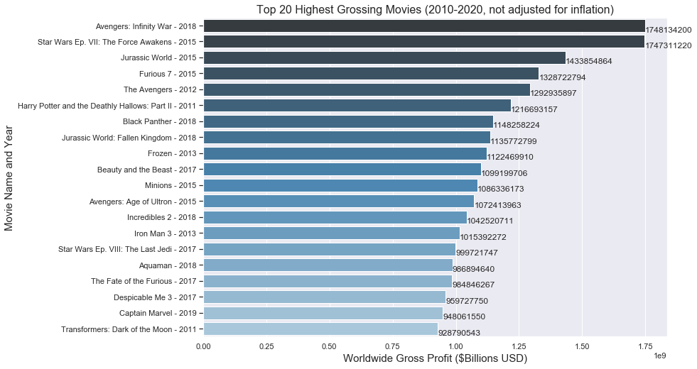
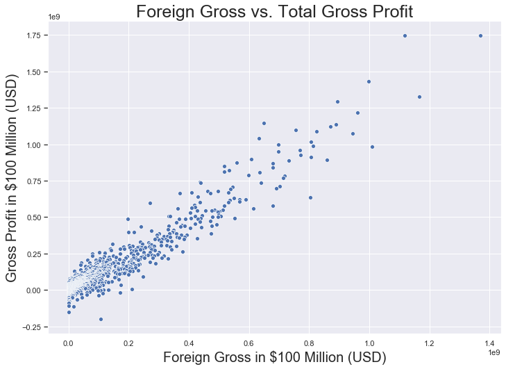
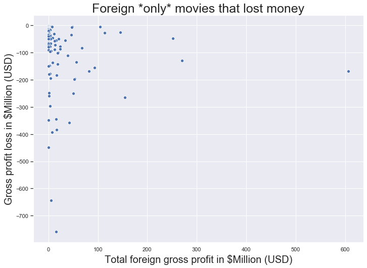
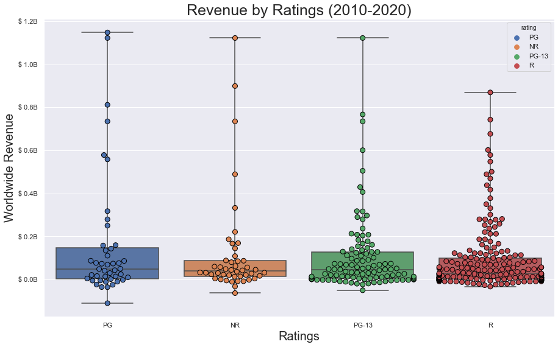

## Final Project Submission

Please fill out:
* Student name: Andrew Hotchkiss
* Student pace: part time
* Scheduled project review date/time: 6/10 from 1200-1245pm
* Instructor name: James Irving
* Blog post URL: https://stones-1130.github.io/mod_1_final_project_approach


# Intro

**Assignment:** 

*To help Microsoft better understand the movie industry and conduct data analysis that explores what types of films are currently doing the best at the box office.* 

*Translate those findings into actionable insights that the Microsoft CEO can use when deciding what types of films he should be creating.* 

**My approach:**

For this project, I focused primarily on analyzing financial data from movie databases such as IMDb, Rotten Tomatoes, and TMDb. 

I broke this project down into two phases, going from big to small. 

**Phase 1-** Analyze movie revenue (domestic and foreign) from the macro perspective to get a better sense of scale. 

**Macro Questions:** 
1. What are the highest grossing movies of all time, and how much did they make? 
2. What are the highest grossing movies from the last ten years (2010-2020)? 
3. Did films make more money in the U.S. or in foreign markets?
4. What percentage of movies are successful?
5. What's the average return on investment for a successful film?
6. What's the average production budget for the top 150 most successful (by worldwide gross) movies of the last ten years?

**Phase 2-** Analyze commonalities in the data for the top performers of the last 10 years.

**Micro Questions:**
1. Which movies had the highest return on investment from the last 10 years (2010-2020)? 
2. Which production companies were the most successful during the past 10 years?
3. Which production company had the highest average ROI?
4. What parental guidance ratings were associated with the highest earnings?

# Getting started

1. Import packages and data


```python
%ls
```

    CONTRIBUTING.md             output_53_0.png
    LICENSE.md                  output_55_0.png
    Mod_1 presentation.pdf      output_58_0.png
    README.md                   output_61_0.png
    awesome.gif                 output_65_0.png
    module1_project_rubric.pdf  output_80_0.png
    output_25_0.png             output_88_0.png
    output_45_0.png             output_97_0.png
    output_47_0.png             student.ipynb
    output_52_0.png             zippedData/


```python
#IMPORT OS MODULE TO BE ABLE TO USE COMMAND LINE IN JUPYTER NOTEBOOK
import os
```


```python
#IMPORT THE MOVIE DATA FROM THE ZIP FILE
os.listdir('zippedData/')
```


    ['imdb.title.crew.csv.gz',
     'tmdb.movies.csv.gz',
     'imdb.title.akas.csv.gz',
     'imdb.title.ratings.csv.gz',
     'imdb.name.basics.csv.gz',
     'rt.reviews.tsv.gz',
     'imdb.title.basics.csv.gz',
     'rt.movie_info.tsv.gz',
     'tn.movie_budgets.csv.gz',
     'bom.movie_gross.csv.gz',
     'imdb.title.principals.csv.gz']


```python
#IMPORT GLOB TO CREATE LIST OF PATHNAMES FOR INDIVIDUAL FILES
import glob

```


```python
file_list = glob.glob('zippedData/*') #make a list of all the files with relative path name 'zippedData'
file_list
```


    ['zippedData/imdb.title.crew.csv.gz',
     'zippedData/tmdb.movies.csv.gz',
     'zippedData/imdb.title.akas.csv.gz',
     'zippedData/imdb.title.ratings.csv.gz',
     'zippedData/imdb.name.basics.csv.gz',
     'zippedData/rt.reviews.tsv.gz',
     'zippedData/imdb.title.basics.csv.gz',
     'zippedData/rt.movie_info.tsv.gz',
     'zippedData/tn.movie_budgets.csv.gz',
     'zippedData/bom.movie_gross.csv.gz',
     'zippedData/imdb.title.principals.csv.gz']


```python
#IMPORT LIBRARIES FOR EDA AND PLOTTING, CREATE PANDAS DATAFRAMES WITH THE MOVIE DATA

import pandas as pd
import numpy as np
import matplotlib.pyplot as plt
import seaborn as sns
%matplotlib inline

df_0 = pd.read_csv(file_list[0])
df_1 = pd.read_csv(file_list[1])
df_2 = pd.read_csv(file_list[2])
df_3 = pd.read_csv(file_list[3])
df_4 = pd.read_csv(file_list[4])
df_5 = pd.read_csv(file_list[5], sep='\t', encoding='latin')
df_6 = pd.read_csv(file_list[6])
df_7 = pd.read_csv(file_list[7], sep='\t', encoding='latin')
df_8 = pd.read_csv(file_list[8])
df_9 = pd.read_csv(file_list[9])
df_10 = pd.read_csv(file_list[10])

```


```python
display(df_0, df_1, df_2, df_3, df_4, df_5, df_6, df_7, df_8, df_9, df_10)
```


<div>
<style scoped>
    .dataframe tbody tr th:only-of-type {
        vertical-align: middle;
    }

    .dataframe tbody tr th {
        vertical-align: top;
    }

    .dataframe thead th {
        text-align: right;
    }
</style>
<table border="1" class="dataframe">
  <thead>
    <tr style="text-align: right;">
      <th></th>
      <th>tconst</th>
      <th>directors</th>
      <th>writers</th>
    </tr>
  </thead>
  <tbody>
    <tr>
      <td>0</td>
      <td>tt0285252</td>
      <td>nm0899854</td>
      <td>nm0899854</td>
    </tr>
    <tr>
      <td>1</td>
      <td>tt0438973</td>
      <td>NaN</td>
      <td>nm0175726,nm1802864</td>
    </tr>
    <tr>
      <td>2</td>
      <td>tt0462036</td>
      <td>nm1940585</td>
      <td>nm1940585</td>
    </tr>
    <tr>
      <td>3</td>
      <td>tt0835418</td>
      <td>nm0151540</td>
      <td>nm0310087,nm0841532</td>
    </tr>
    <tr>
      <td>4</td>
      <td>tt0878654</td>
      <td>nm0089502,nm2291498,nm2292011</td>
      <td>nm0284943</td>
    </tr>
    <tr>
      <td>...</td>
      <td>...</td>
      <td>...</td>
      <td>...</td>
    </tr>
    <tr>
      <td>146139</td>
      <td>tt8999974</td>
      <td>nm10122357</td>
      <td>nm10122357</td>
    </tr>
    <tr>
      <td>146140</td>
      <td>tt9001390</td>
      <td>nm6711477</td>
      <td>nm6711477</td>
    </tr>
    <tr>
      <td>146141</td>
      <td>tt9001494</td>
      <td>nm10123242,nm10123248</td>
      <td>NaN</td>
    </tr>
    <tr>
      <td>146142</td>
      <td>tt9004986</td>
      <td>nm4993825</td>
      <td>nm4993825</td>
    </tr>
    <tr>
      <td>146143</td>
      <td>tt9010172</td>
      <td>NaN</td>
      <td>nm8352242</td>
    </tr>
  </tbody>
</table>
<p>146144 rows × 3 columns</p>
</div>


<div>
<style scoped>
    .dataframe tbody tr th:only-of-type {
        vertical-align: middle;
    }

    .dataframe tbody tr th {
        vertical-align: top;
    }

    .dataframe thead th {
        text-align: right;
    }
</style>
<table border="1" class="dataframe">
  <thead>
    <tr style="text-align: right;">
      <th></th>
      <th>Unnamed: 0</th>
      <th>genre_ids</th>
      <th>id</th>
      <th>original_language</th>
      <th>original_title</th>
      <th>popularity</th>
      <th>release_date</th>
      <th>title</th>
      <th>vote_average</th>
      <th>vote_count</th>
    </tr>
  </thead>
  <tbody>
    <tr>
      <td>0</td>
      <td>0</td>
      <td>[12, 14, 10751]</td>
      <td>12444</td>
      <td>en</td>
      <td>Harry Potter and the Deathly Hallows: Part 1</td>
      <td>33.533</td>
      <td>2010-11-19</td>
      <td>Harry Potter and the Deathly Hallows: Part 1</td>
      <td>7.7</td>
      <td>10788</td>
    </tr>
    <tr>
      <td>1</td>
      <td>1</td>
      <td>[14, 12, 16, 10751]</td>
      <td>10191</td>
      <td>en</td>
      <td>How to Train Your Dragon</td>
      <td>28.734</td>
      <td>2010-03-26</td>
      <td>How to Train Your Dragon</td>
      <td>7.7</td>
      <td>7610</td>
    </tr>
    <tr>
      <td>2</td>
      <td>2</td>
      <td>[12, 28, 878]</td>
      <td>10138</td>
      <td>en</td>
      <td>Iron Man 2</td>
      <td>28.515</td>
      <td>2010-05-07</td>
      <td>Iron Man 2</td>
      <td>6.8</td>
      <td>12368</td>
    </tr>
    <tr>
      <td>3</td>
      <td>3</td>
      <td>[16, 35, 10751]</td>
      <td>862</td>
      <td>en</td>
      <td>Toy Story</td>
      <td>28.005</td>
      <td>1995-11-22</td>
      <td>Toy Story</td>
      <td>7.9</td>
      <td>10174</td>
    </tr>
    <tr>
      <td>4</td>
      <td>4</td>
      <td>[28, 878, 12]</td>
      <td>27205</td>
      <td>en</td>
      <td>Inception</td>
      <td>27.920</td>
      <td>2010-07-16</td>
      <td>Inception</td>
      <td>8.3</td>
      <td>22186</td>
    </tr>
    <tr>
      <td>...</td>
      <td>...</td>
      <td>...</td>
      <td>...</td>
      <td>...</td>
      <td>...</td>
      <td>...</td>
      <td>...</td>
      <td>...</td>
      <td>...</td>
      <td>...</td>
    </tr>
    <tr>
      <td>26512</td>
      <td>26512</td>
      <td>[27, 18]</td>
      <td>488143</td>
      <td>en</td>
      <td>Laboratory Conditions</td>
      <td>0.600</td>
      <td>2018-10-13</td>
      <td>Laboratory Conditions</td>
      <td>0.0</td>
      <td>1</td>
    </tr>
    <tr>
      <td>26513</td>
      <td>26513</td>
      <td>[18, 53]</td>
      <td>485975</td>
      <td>en</td>
      <td>_EXHIBIT_84xxx_</td>
      <td>0.600</td>
      <td>2018-05-01</td>
      <td>_EXHIBIT_84xxx_</td>
      <td>0.0</td>
      <td>1</td>
    </tr>
    <tr>
      <td>26514</td>
      <td>26514</td>
      <td>[14, 28, 12]</td>
      <td>381231</td>
      <td>en</td>
      <td>The Last One</td>
      <td>0.600</td>
      <td>2018-10-01</td>
      <td>The Last One</td>
      <td>0.0</td>
      <td>1</td>
    </tr>
    <tr>
      <td>26515</td>
      <td>26515</td>
      <td>[10751, 12, 28]</td>
      <td>366854</td>
      <td>en</td>
      <td>Trailer Made</td>
      <td>0.600</td>
      <td>2018-06-22</td>
      <td>Trailer Made</td>
      <td>0.0</td>
      <td>1</td>
    </tr>
    <tr>
      <td>26516</td>
      <td>26516</td>
      <td>[53, 27]</td>
      <td>309885</td>
      <td>en</td>
      <td>The Church</td>
      <td>0.600</td>
      <td>2018-10-05</td>
      <td>The Church</td>
      <td>0.0</td>
      <td>1</td>
    </tr>
  </tbody>
</table>
<p>26517 rows × 10 columns</p>
</div>


<div>
<style scoped>
    .dataframe tbody tr th:only-of-type {
        vertical-align: middle;
    }

    .dataframe tbody tr th {
        vertical-align: top;
    }

    .dataframe thead th {
        text-align: right;
    }
</style>
<table border="1" class="dataframe">
  <thead>
    <tr style="text-align: right;">
      <th></th>
      <th>title_id</th>
      <th>ordering</th>
      <th>title</th>
      <th>region</th>
      <th>language</th>
      <th>types</th>
      <th>attributes</th>
      <th>is_original_title</th>
    </tr>
  </thead>
  <tbody>
    <tr>
      <td>0</td>
      <td>tt0369610</td>
      <td>10</td>
      <td>Джурасик свят</td>
      <td>BG</td>
      <td>bg</td>
      <td>NaN</td>
      <td>NaN</td>
      <td>0.0</td>
    </tr>
    <tr>
      <td>1</td>
      <td>tt0369610</td>
      <td>11</td>
      <td>Jurashikku warudo</td>
      <td>JP</td>
      <td>NaN</td>
      <td>imdbDisplay</td>
      <td>NaN</td>
      <td>0.0</td>
    </tr>
    <tr>
      <td>2</td>
      <td>tt0369610</td>
      <td>12</td>
      <td>Jurassic World: O Mundo dos Dinossauros</td>
      <td>BR</td>
      <td>NaN</td>
      <td>imdbDisplay</td>
      <td>NaN</td>
      <td>0.0</td>
    </tr>
    <tr>
      <td>3</td>
      <td>tt0369610</td>
      <td>13</td>
      <td>O Mundo dos Dinossauros</td>
      <td>BR</td>
      <td>NaN</td>
      <td>NaN</td>
      <td>short title</td>
      <td>0.0</td>
    </tr>
    <tr>
      <td>4</td>
      <td>tt0369610</td>
      <td>14</td>
      <td>Jurassic World</td>
      <td>FR</td>
      <td>NaN</td>
      <td>imdbDisplay</td>
      <td>NaN</td>
      <td>0.0</td>
    </tr>
    <tr>
      <td>...</td>
      <td>...</td>
      <td>...</td>
      <td>...</td>
      <td>...</td>
      <td>...</td>
      <td>...</td>
      <td>...</td>
      <td>...</td>
    </tr>
    <tr>
      <td>331698</td>
      <td>tt9827784</td>
      <td>2</td>
      <td>Sayonara kuchibiru</td>
      <td>NaN</td>
      <td>NaN</td>
      <td>original</td>
      <td>NaN</td>
      <td>1.0</td>
    </tr>
    <tr>
      <td>331699</td>
      <td>tt9827784</td>
      <td>3</td>
      <td>Farewell Song</td>
      <td>XWW</td>
      <td>en</td>
      <td>imdbDisplay</td>
      <td>NaN</td>
      <td>0.0</td>
    </tr>
    <tr>
      <td>331700</td>
      <td>tt9880178</td>
      <td>1</td>
      <td>La atención</td>
      <td>NaN</td>
      <td>NaN</td>
      <td>original</td>
      <td>NaN</td>
      <td>1.0</td>
    </tr>
    <tr>
      <td>331701</td>
      <td>tt9880178</td>
      <td>2</td>
      <td>La atención</td>
      <td>ES</td>
      <td>NaN</td>
      <td>NaN</td>
      <td>NaN</td>
      <td>0.0</td>
    </tr>
    <tr>
      <td>331702</td>
      <td>tt9880178</td>
      <td>3</td>
      <td>The Attention</td>
      <td>XWW</td>
      <td>en</td>
      <td>imdbDisplay</td>
      <td>NaN</td>
      <td>0.0</td>
    </tr>
  </tbody>
</table>
<p>331703 rows × 8 columns</p>
</div>


<div>
<style scoped>
    .dataframe tbody tr th:only-of-type {
        vertical-align: middle;
    }

    .dataframe tbody tr th {
        vertical-align: top;
    }

    .dataframe thead th {
        text-align: right;
    }
</style>
<table border="1" class="dataframe">
  <thead>
    <tr style="text-align: right;">
      <th></th>
      <th>tconst</th>
      <th>averagerating</th>
      <th>numvotes</th>
    </tr>
  </thead>
  <tbody>
    <tr>
      <td>0</td>
      <td>tt10356526</td>
      <td>8.3</td>
      <td>31</td>
    </tr>
    <tr>
      <td>1</td>
      <td>tt10384606</td>
      <td>8.9</td>
      <td>559</td>
    </tr>
    <tr>
      <td>2</td>
      <td>tt1042974</td>
      <td>6.4</td>
      <td>20</td>
    </tr>
    <tr>
      <td>3</td>
      <td>tt1043726</td>
      <td>4.2</td>
      <td>50352</td>
    </tr>
    <tr>
      <td>4</td>
      <td>tt1060240</td>
      <td>6.5</td>
      <td>21</td>
    </tr>
    <tr>
      <td>...</td>
      <td>...</td>
      <td>...</td>
      <td>...</td>
    </tr>
    <tr>
      <td>73851</td>
      <td>tt9805820</td>
      <td>8.1</td>
      <td>25</td>
    </tr>
    <tr>
      <td>73852</td>
      <td>tt9844256</td>
      <td>7.5</td>
      <td>24</td>
    </tr>
    <tr>
      <td>73853</td>
      <td>tt9851050</td>
      <td>4.7</td>
      <td>14</td>
    </tr>
    <tr>
      <td>73854</td>
      <td>tt9886934</td>
      <td>7.0</td>
      <td>5</td>
    </tr>
    <tr>
      <td>73855</td>
      <td>tt9894098</td>
      <td>6.3</td>
      <td>128</td>
    </tr>
  </tbody>
</table>
<p>73856 rows × 3 columns</p>
</div>


<div>
<style scoped>
    .dataframe tbody tr th:only-of-type {
        vertical-align: middle;
    }

    .dataframe tbody tr th {
        vertical-align: top;
    }

    .dataframe thead th {
        text-align: right;
    }
</style>
<table border="1" class="dataframe">
  <thead>
    <tr style="text-align: right;">
      <th></th>
      <th>nconst</th>
      <th>primary_name</th>
      <th>birth_year</th>
      <th>death_year</th>
      <th>primary_profession</th>
      <th>known_for_titles</th>
    </tr>
  </thead>
  <tbody>
    <tr>
      <td>0</td>
      <td>nm0061671</td>
      <td>Mary Ellen Bauder</td>
      <td>NaN</td>
      <td>NaN</td>
      <td>miscellaneous,production_manager,producer</td>
      <td>tt0837562,tt2398241,tt0844471,tt0118553</td>
    </tr>
    <tr>
      <td>1</td>
      <td>nm0061865</td>
      <td>Joseph Bauer</td>
      <td>NaN</td>
      <td>NaN</td>
      <td>composer,music_department,sound_department</td>
      <td>tt0896534,tt6791238,tt0287072,tt1682940</td>
    </tr>
    <tr>
      <td>2</td>
      <td>nm0062070</td>
      <td>Bruce Baum</td>
      <td>NaN</td>
      <td>NaN</td>
      <td>miscellaneous,actor,writer</td>
      <td>tt1470654,tt0363631,tt0104030,tt0102898</td>
    </tr>
    <tr>
      <td>3</td>
      <td>nm0062195</td>
      <td>Axel Baumann</td>
      <td>NaN</td>
      <td>NaN</td>
      <td>camera_department,cinematographer,art_department</td>
      <td>tt0114371,tt2004304,tt1618448,tt1224387</td>
    </tr>
    <tr>
      <td>4</td>
      <td>nm0062798</td>
      <td>Pete Baxter</td>
      <td>NaN</td>
      <td>NaN</td>
      <td>production_designer,art_department,set_decorator</td>
      <td>tt0452644,tt0452692,tt3458030,tt2178256</td>
    </tr>
    <tr>
      <td>...</td>
      <td>...</td>
      <td>...</td>
      <td>...</td>
      <td>...</td>
      <td>...</td>
      <td>...</td>
    </tr>
    <tr>
      <td>606643</td>
      <td>nm9990381</td>
      <td>Susan Grobes</td>
      <td>NaN</td>
      <td>NaN</td>
      <td>actress</td>
      <td>NaN</td>
    </tr>
    <tr>
      <td>606644</td>
      <td>nm9990690</td>
      <td>Joo Yeon So</td>
      <td>NaN</td>
      <td>NaN</td>
      <td>actress</td>
      <td>tt9090932,tt8737130</td>
    </tr>
    <tr>
      <td>606645</td>
      <td>nm9991320</td>
      <td>Madeline Smith</td>
      <td>NaN</td>
      <td>NaN</td>
      <td>actress</td>
      <td>tt8734436,tt9615610</td>
    </tr>
    <tr>
      <td>606646</td>
      <td>nm9991786</td>
      <td>Michelle Modigliani</td>
      <td>NaN</td>
      <td>NaN</td>
      <td>producer</td>
      <td>NaN</td>
    </tr>
    <tr>
      <td>606647</td>
      <td>nm9993380</td>
      <td>Pegasus Envoyé</td>
      <td>NaN</td>
      <td>NaN</td>
      <td>director,actor,writer</td>
      <td>tt8743182</td>
    </tr>
  </tbody>
</table>
<p>606648 rows × 6 columns</p>
</div>


<div>
<style scoped>
    .dataframe tbody tr th:only-of-type {
        vertical-align: middle;
    }

    .dataframe tbody tr th {
        vertical-align: top;
    }

    .dataframe thead th {
        text-align: right;
    }
</style>
<table border="1" class="dataframe">
  <thead>
    <tr style="text-align: right;">
      <th></th>
      <th>id</th>
      <th>review</th>
      <th>rating</th>
      <th>fresh</th>
      <th>critic</th>
      <th>top_critic</th>
      <th>publisher</th>
      <th>date</th>
    </tr>
  </thead>
  <tbody>
    <tr>
      <td>0</td>
      <td>3</td>
      <td>A distinctly gallows take on contemporary fina...</td>
      <td>3/5</td>
      <td>fresh</td>
      <td>PJ Nabarro</td>
      <td>0</td>
      <td>Patrick Nabarro</td>
      <td>November 10, 2018</td>
    </tr>
    <tr>
      <td>1</td>
      <td>3</td>
      <td>It's an allegory in search of a meaning that n...</td>
      <td>NaN</td>
      <td>rotten</td>
      <td>Annalee Newitz</td>
      <td>0</td>
      <td>io9.com</td>
      <td>May 23, 2018</td>
    </tr>
    <tr>
      <td>2</td>
      <td>3</td>
      <td>... life lived in a bubble in financial dealin...</td>
      <td>NaN</td>
      <td>fresh</td>
      <td>Sean Axmaker</td>
      <td>0</td>
      <td>Stream on Demand</td>
      <td>January 4, 2018</td>
    </tr>
    <tr>
      <td>3</td>
      <td>3</td>
      <td>Continuing along a line introduced in last yea...</td>
      <td>NaN</td>
      <td>fresh</td>
      <td>Daniel Kasman</td>
      <td>0</td>
      <td>MUBI</td>
      <td>November 16, 2017</td>
    </tr>
    <tr>
      <td>4</td>
      <td>3</td>
      <td>... a perverse twist on neorealism...</td>
      <td>NaN</td>
      <td>fresh</td>
      <td>NaN</td>
      <td>0</td>
      <td>Cinema Scope</td>
      <td>October 12, 2017</td>
    </tr>
    <tr>
      <td>...</td>
      <td>...</td>
      <td>...</td>
      <td>...</td>
      <td>...</td>
      <td>...</td>
      <td>...</td>
      <td>...</td>
      <td>...</td>
    </tr>
    <tr>
      <td>54427</td>
      <td>2000</td>
      <td>The real charm of this trifle is the deadpan c...</td>
      <td>NaN</td>
      <td>fresh</td>
      <td>Laura Sinagra</td>
      <td>1</td>
      <td>Village Voice</td>
      <td>September 24, 2002</td>
    </tr>
    <tr>
      <td>54428</td>
      <td>2000</td>
      <td>NaN</td>
      <td>1/5</td>
      <td>rotten</td>
      <td>Michael Szymanski</td>
      <td>0</td>
      <td>Zap2it.com</td>
      <td>September 21, 2005</td>
    </tr>
    <tr>
      <td>54429</td>
      <td>2000</td>
      <td>NaN</td>
      <td>2/5</td>
      <td>rotten</td>
      <td>Emanuel Levy</td>
      <td>0</td>
      <td>EmanuelLevy.Com</td>
      <td>July 17, 2005</td>
    </tr>
    <tr>
      <td>54430</td>
      <td>2000</td>
      <td>NaN</td>
      <td>2.5/5</td>
      <td>rotten</td>
      <td>Christopher Null</td>
      <td>0</td>
      <td>Filmcritic.com</td>
      <td>September 7, 2003</td>
    </tr>
    <tr>
      <td>54431</td>
      <td>2000</td>
      <td>NaN</td>
      <td>3/5</td>
      <td>fresh</td>
      <td>Nicolas Lacroix</td>
      <td>0</td>
      <td>Showbizz.net</td>
      <td>November 12, 2002</td>
    </tr>
  </tbody>
</table>
<p>54432 rows × 8 columns</p>
</div>


<div>
<style scoped>
    .dataframe tbody tr th:only-of-type {
        vertical-align: middle;
    }

    .dataframe tbody tr th {
        vertical-align: top;
    }

    .dataframe thead th {
        text-align: right;
    }
</style>
<table border="1" class="dataframe">
  <thead>
    <tr style="text-align: right;">
      <th></th>
      <th>tconst</th>
      <th>primary_title</th>
      <th>original_title</th>
      <th>start_year</th>
      <th>runtime_minutes</th>
      <th>genres</th>
    </tr>
  </thead>
  <tbody>
    <tr>
      <td>0</td>
      <td>tt0063540</td>
      <td>Sunghursh</td>
      <td>Sunghursh</td>
      <td>2013</td>
      <td>175.0</td>
      <td>Action,Crime,Drama</td>
    </tr>
    <tr>
      <td>1</td>
      <td>tt0066787</td>
      <td>One Day Before the Rainy Season</td>
      <td>Ashad Ka Ek Din</td>
      <td>2019</td>
      <td>114.0</td>
      <td>Biography,Drama</td>
    </tr>
    <tr>
      <td>2</td>
      <td>tt0069049</td>
      <td>The Other Side of the Wind</td>
      <td>The Other Side of the Wind</td>
      <td>2018</td>
      <td>122.0</td>
      <td>Drama</td>
    </tr>
    <tr>
      <td>3</td>
      <td>tt0069204</td>
      <td>Sabse Bada Sukh</td>
      <td>Sabse Bada Sukh</td>
      <td>2018</td>
      <td>NaN</td>
      <td>Comedy,Drama</td>
    </tr>
    <tr>
      <td>4</td>
      <td>tt0100275</td>
      <td>The Wandering Soap Opera</td>
      <td>La Telenovela Errante</td>
      <td>2017</td>
      <td>80.0</td>
      <td>Comedy,Drama,Fantasy</td>
    </tr>
    <tr>
      <td>...</td>
      <td>...</td>
      <td>...</td>
      <td>...</td>
      <td>...</td>
      <td>...</td>
      <td>...</td>
    </tr>
    <tr>
      <td>146139</td>
      <td>tt9916538</td>
      <td>Kuambil Lagi Hatiku</td>
      <td>Kuambil Lagi Hatiku</td>
      <td>2019</td>
      <td>123.0</td>
      <td>Drama</td>
    </tr>
    <tr>
      <td>146140</td>
      <td>tt9916622</td>
      <td>Rodolpho Teóphilo - O Legado de um Pioneiro</td>
      <td>Rodolpho Teóphilo - O Legado de um Pioneiro</td>
      <td>2015</td>
      <td>NaN</td>
      <td>Documentary</td>
    </tr>
    <tr>
      <td>146141</td>
      <td>tt9916706</td>
      <td>Dankyavar Danka</td>
      <td>Dankyavar Danka</td>
      <td>2013</td>
      <td>NaN</td>
      <td>Comedy</td>
    </tr>
    <tr>
      <td>146142</td>
      <td>tt9916730</td>
      <td>6 Gunn</td>
      <td>6 Gunn</td>
      <td>2017</td>
      <td>116.0</td>
      <td>NaN</td>
    </tr>
    <tr>
      <td>146143</td>
      <td>tt9916754</td>
      <td>Chico Albuquerque - Revelações</td>
      <td>Chico Albuquerque - Revelações</td>
      <td>2013</td>
      <td>NaN</td>
      <td>Documentary</td>
    </tr>
  </tbody>
</table>
<p>146144 rows × 6 columns</p>
</div>


<div>
<style scoped>
    .dataframe tbody tr th:only-of-type {
        vertical-align: middle;
    }

    .dataframe tbody tr th {
        vertical-align: top;
    }

    .dataframe thead th {
        text-align: right;
    }
</style>
<table border="1" class="dataframe">
  <thead>
    <tr style="text-align: right;">
      <th></th>
      <th>id</th>
      <th>synopsis</th>
      <th>rating</th>
      <th>genre</th>
      <th>director</th>
      <th>writer</th>
      <th>theater_date</th>
      <th>dvd_date</th>
      <th>currency</th>
      <th>box_office</th>
      <th>runtime</th>
      <th>studio</th>
    </tr>
  </thead>
  <tbody>
    <tr>
      <td>0</td>
      <td>1</td>
      <td>This gritty, fast-paced, and innovative police...</td>
      <td>R</td>
      <td>Action and Adventure|Classics|Drama</td>
      <td>William Friedkin</td>
      <td>Ernest Tidyman</td>
      <td>Oct 9, 1971</td>
      <td>Sep 25, 2001</td>
      <td>NaN</td>
      <td>NaN</td>
      <td>104 minutes</td>
      <td>NaN</td>
    </tr>
    <tr>
      <td>1</td>
      <td>3</td>
      <td>New York City, not-too-distant-future: Eric Pa...</td>
      <td>R</td>
      <td>Drama|Science Fiction and Fantasy</td>
      <td>David Cronenberg</td>
      <td>David Cronenberg|Don DeLillo</td>
      <td>Aug 17, 2012</td>
      <td>Jan 1, 2013</td>
      <td>$</td>
      <td>600,000</td>
      <td>108 minutes</td>
      <td>Entertainment One</td>
    </tr>
    <tr>
      <td>2</td>
      <td>5</td>
      <td>Illeana Douglas delivers a superb performance ...</td>
      <td>R</td>
      <td>Drama|Musical and Performing Arts</td>
      <td>Allison Anders</td>
      <td>Allison Anders</td>
      <td>Sep 13, 1996</td>
      <td>Apr 18, 2000</td>
      <td>NaN</td>
      <td>NaN</td>
      <td>116 minutes</td>
      <td>NaN</td>
    </tr>
    <tr>
      <td>3</td>
      <td>6</td>
      <td>Michael Douglas runs afoul of a treacherous su...</td>
      <td>R</td>
      <td>Drama|Mystery and Suspense</td>
      <td>Barry Levinson</td>
      <td>Paul Attanasio|Michael Crichton</td>
      <td>Dec 9, 1994</td>
      <td>Aug 27, 1997</td>
      <td>NaN</td>
      <td>NaN</td>
      <td>128 minutes</td>
      <td>NaN</td>
    </tr>
    <tr>
      <td>4</td>
      <td>7</td>
      <td>NaN</td>
      <td>NR</td>
      <td>Drama|Romance</td>
      <td>Rodney Bennett</td>
      <td>Giles Cooper</td>
      <td>NaN</td>
      <td>NaN</td>
      <td>NaN</td>
      <td>NaN</td>
      <td>200 minutes</td>
      <td>NaN</td>
    </tr>
    <tr>
      <td>...</td>
      <td>...</td>
      <td>...</td>
      <td>...</td>
      <td>...</td>
      <td>...</td>
      <td>...</td>
      <td>...</td>
      <td>...</td>
      <td>...</td>
      <td>...</td>
      <td>...</td>
      <td>...</td>
    </tr>
    <tr>
      <td>1555</td>
      <td>1996</td>
      <td>Forget terrorists or hijackers -- there's a ha...</td>
      <td>R</td>
      <td>Action and Adventure|Horror|Mystery and Suspense</td>
      <td>NaN</td>
      <td>NaN</td>
      <td>Aug 18, 2006</td>
      <td>Jan 2, 2007</td>
      <td>$</td>
      <td>33,886,034</td>
      <td>106 minutes</td>
      <td>New Line Cinema</td>
    </tr>
    <tr>
      <td>1556</td>
      <td>1997</td>
      <td>The popular Saturday Night Live sketch was exp...</td>
      <td>PG</td>
      <td>Comedy|Science Fiction and Fantasy</td>
      <td>Steve Barron</td>
      <td>Terry Turner|Tom Davis|Dan Aykroyd|Bonnie Turner</td>
      <td>Jul 23, 1993</td>
      <td>Apr 17, 2001</td>
      <td>NaN</td>
      <td>NaN</td>
      <td>88 minutes</td>
      <td>Paramount Vantage</td>
    </tr>
    <tr>
      <td>1557</td>
      <td>1998</td>
      <td>Based on a novel by Richard Powell, when the l...</td>
      <td>G</td>
      <td>Classics|Comedy|Drama|Musical and Performing Arts</td>
      <td>Gordon Douglas</td>
      <td>NaN</td>
      <td>Jan 1, 1962</td>
      <td>May 11, 2004</td>
      <td>NaN</td>
      <td>NaN</td>
      <td>111 minutes</td>
      <td>NaN</td>
    </tr>
    <tr>
      <td>1558</td>
      <td>1999</td>
      <td>The Sandlot is a coming-of-age story about a g...</td>
      <td>PG</td>
      <td>Comedy|Drama|Kids and Family|Sports and Fitness</td>
      <td>David Mickey Evans</td>
      <td>David Mickey Evans|Robert Gunter</td>
      <td>Apr 1, 1993</td>
      <td>Jan 29, 2002</td>
      <td>NaN</td>
      <td>NaN</td>
      <td>101 minutes</td>
      <td>NaN</td>
    </tr>
    <tr>
      <td>1559</td>
      <td>2000</td>
      <td>Suspended from the force, Paris cop Hubert is ...</td>
      <td>R</td>
      <td>Action and Adventure|Art House and Internation...</td>
      <td>NaN</td>
      <td>Luc Besson</td>
      <td>Sep 27, 2001</td>
      <td>Feb 11, 2003</td>
      <td>NaN</td>
      <td>NaN</td>
      <td>94 minutes</td>
      <td>Columbia Pictures</td>
    </tr>
  </tbody>
</table>
<p>1560 rows × 12 columns</p>
</div>


<div>
<style scoped>
    .dataframe tbody tr th:only-of-type {
        vertical-align: middle;
    }

    .dataframe tbody tr th {
        vertical-align: top;
    }

    .dataframe thead th {
        text-align: right;
    }
</style>
<table border="1" class="dataframe">
  <thead>
    <tr style="text-align: right;">
      <th></th>
      <th>id</th>
      <th>release_date</th>
      <th>movie</th>
      <th>production_budget</th>
      <th>domestic_gross</th>
      <th>worldwide_gross</th>
    </tr>
  </thead>
  <tbody>
    <tr>
      <td>0</td>
      <td>1</td>
      <td>Dec 18, 2009</td>
      <td>Avatar</td>
      <td>$425,000,000</td>
      <td>$760,507,625</td>
      <td>$2,776,345,279</td>
    </tr>
    <tr>
      <td>1</td>
      <td>2</td>
      <td>May 20, 2011</td>
      <td>Pirates of the Caribbean: On Stranger Tides</td>
      <td>$410,600,000</td>
      <td>$241,063,875</td>
      <td>$1,045,663,875</td>
    </tr>
    <tr>
      <td>2</td>
      <td>3</td>
      <td>Jun 7, 2019</td>
      <td>Dark Phoenix</td>
      <td>$350,000,000</td>
      <td>$42,762,350</td>
      <td>$149,762,350</td>
    </tr>
    <tr>
      <td>3</td>
      <td>4</td>
      <td>May 1, 2015</td>
      <td>Avengers: Age of Ultron</td>
      <td>$330,600,000</td>
      <td>$459,005,868</td>
      <td>$1,403,013,963</td>
    </tr>
    <tr>
      <td>4</td>
      <td>5</td>
      <td>Dec 15, 2017</td>
      <td>Star Wars Ep. VIII: The Last Jedi</td>
      <td>$317,000,000</td>
      <td>$620,181,382</td>
      <td>$1,316,721,747</td>
    </tr>
    <tr>
      <td>...</td>
      <td>...</td>
      <td>...</td>
      <td>...</td>
      <td>...</td>
      <td>...</td>
      <td>...</td>
    </tr>
    <tr>
      <td>5777</td>
      <td>78</td>
      <td>Dec 31, 2018</td>
      <td>Red 11</td>
      <td>$7,000</td>
      <td>$0</td>
      <td>$0</td>
    </tr>
    <tr>
      <td>5778</td>
      <td>79</td>
      <td>Apr 2, 1999</td>
      <td>Following</td>
      <td>$6,000</td>
      <td>$48,482</td>
      <td>$240,495</td>
    </tr>
    <tr>
      <td>5779</td>
      <td>80</td>
      <td>Jul 13, 2005</td>
      <td>Return to the Land of Wonders</td>
      <td>$5,000</td>
      <td>$1,338</td>
      <td>$1,338</td>
    </tr>
    <tr>
      <td>5780</td>
      <td>81</td>
      <td>Sep 29, 2015</td>
      <td>A Plague So Pleasant</td>
      <td>$1,400</td>
      <td>$0</td>
      <td>$0</td>
    </tr>
    <tr>
      <td>5781</td>
      <td>82</td>
      <td>Aug 5, 2005</td>
      <td>My Date With Drew</td>
      <td>$1,100</td>
      <td>$181,041</td>
      <td>$181,041</td>
    </tr>
  </tbody>
</table>
<p>5782 rows × 6 columns</p>
</div>


<div>
<style scoped>
    .dataframe tbody tr th:only-of-type {
        vertical-align: middle;
    }

    .dataframe tbody tr th {
        vertical-align: top;
    }

    .dataframe thead th {
        text-align: right;
    }
</style>
<table border="1" class="dataframe">
  <thead>
    <tr style="text-align: right;">
      <th></th>
      <th>title</th>
      <th>studio</th>
      <th>domestic_gross</th>
      <th>foreign_gross</th>
      <th>year</th>
    </tr>
  </thead>
  <tbody>
    <tr>
      <td>0</td>
      <td>Toy Story 3</td>
      <td>BV</td>
      <td>415000000.0</td>
      <td>652000000</td>
      <td>2010</td>
    </tr>
    <tr>
      <td>1</td>
      <td>Alice in Wonderland (2010)</td>
      <td>BV</td>
      <td>334200000.0</td>
      <td>691300000</td>
      <td>2010</td>
    </tr>
    <tr>
      <td>2</td>
      <td>Harry Potter and the Deathly Hallows Part 1</td>
      <td>WB</td>
      <td>296000000.0</td>
      <td>664300000</td>
      <td>2010</td>
    </tr>
    <tr>
      <td>3</td>
      <td>Inception</td>
      <td>WB</td>
      <td>292600000.0</td>
      <td>535700000</td>
      <td>2010</td>
    </tr>
    <tr>
      <td>4</td>
      <td>Shrek Forever After</td>
      <td>P/DW</td>
      <td>238700000.0</td>
      <td>513900000</td>
      <td>2010</td>
    </tr>
    <tr>
      <td>...</td>
      <td>...</td>
      <td>...</td>
      <td>...</td>
      <td>...</td>
      <td>...</td>
    </tr>
    <tr>
      <td>3382</td>
      <td>The Quake</td>
      <td>Magn.</td>
      <td>6200.0</td>
      <td>NaN</td>
      <td>2018</td>
    </tr>
    <tr>
      <td>3383</td>
      <td>Edward II (2018 re-release)</td>
      <td>FM</td>
      <td>4800.0</td>
      <td>NaN</td>
      <td>2018</td>
    </tr>
    <tr>
      <td>3384</td>
      <td>El Pacto</td>
      <td>Sony</td>
      <td>2500.0</td>
      <td>NaN</td>
      <td>2018</td>
    </tr>
    <tr>
      <td>3385</td>
      <td>The Swan</td>
      <td>Synergetic</td>
      <td>2400.0</td>
      <td>NaN</td>
      <td>2018</td>
    </tr>
    <tr>
      <td>3386</td>
      <td>An Actor Prepares</td>
      <td>Grav.</td>
      <td>1700.0</td>
      <td>NaN</td>
      <td>2018</td>
    </tr>
  </tbody>
</table>
<p>3387 rows × 5 columns</p>
</div>


<div>
<style scoped>
    .dataframe tbody tr th:only-of-type {
        vertical-align: middle;
    }

    .dataframe tbody tr th {
        vertical-align: top;
    }

    .dataframe thead th {
        text-align: right;
    }
</style>
<table border="1" class="dataframe">
  <thead>
    <tr style="text-align: right;">
      <th></th>
      <th>tconst</th>
      <th>ordering</th>
      <th>nconst</th>
      <th>category</th>
      <th>job</th>
      <th>characters</th>
    </tr>
  </thead>
  <tbody>
    <tr>
      <td>0</td>
      <td>tt0111414</td>
      <td>1</td>
      <td>nm0246005</td>
      <td>actor</td>
      <td>NaN</td>
      <td>["The Man"]</td>
    </tr>
    <tr>
      <td>1</td>
      <td>tt0111414</td>
      <td>2</td>
      <td>nm0398271</td>
      <td>director</td>
      <td>NaN</td>
      <td>NaN</td>
    </tr>
    <tr>
      <td>2</td>
      <td>tt0111414</td>
      <td>3</td>
      <td>nm3739909</td>
      <td>producer</td>
      <td>producer</td>
      <td>NaN</td>
    </tr>
    <tr>
      <td>3</td>
      <td>tt0323808</td>
      <td>10</td>
      <td>nm0059247</td>
      <td>editor</td>
      <td>NaN</td>
      <td>NaN</td>
    </tr>
    <tr>
      <td>4</td>
      <td>tt0323808</td>
      <td>1</td>
      <td>nm3579312</td>
      <td>actress</td>
      <td>NaN</td>
      <td>["Beth Boothby"]</td>
    </tr>
    <tr>
      <td>...</td>
      <td>...</td>
      <td>...</td>
      <td>...</td>
      <td>...</td>
      <td>...</td>
      <td>...</td>
    </tr>
    <tr>
      <td>1028181</td>
      <td>tt9692684</td>
      <td>1</td>
      <td>nm0186469</td>
      <td>actor</td>
      <td>NaN</td>
      <td>["Ebenezer Scrooge"]</td>
    </tr>
    <tr>
      <td>1028182</td>
      <td>tt9692684</td>
      <td>2</td>
      <td>nm4929530</td>
      <td>self</td>
      <td>NaN</td>
      <td>["Herself","Regan"]</td>
    </tr>
    <tr>
      <td>1028183</td>
      <td>tt9692684</td>
      <td>3</td>
      <td>nm10441594</td>
      <td>director</td>
      <td>NaN</td>
      <td>NaN</td>
    </tr>
    <tr>
      <td>1028184</td>
      <td>tt9692684</td>
      <td>4</td>
      <td>nm6009913</td>
      <td>writer</td>
      <td>writer</td>
      <td>NaN</td>
    </tr>
    <tr>
      <td>1028185</td>
      <td>tt9692684</td>
      <td>5</td>
      <td>nm10441595</td>
      <td>producer</td>
      <td>producer</td>
      <td>NaN</td>
    </tr>
  </tbody>
</table>
<p>1028186 rows × 6 columns</p>
</div>


## Compile notes on the files
0.  imdb.title.crew.csv.gz
    - Nothing interesting, columns appear to be encoded
1. tmdb.movies.csv.gz
    - Definitely interesting
    - Columns: review (text), rating (x/5), fresh/rotten (str), critic name (str), top critic (Boolean), publisher (str), Date of review
2. imdb.title.akas.csv.gz
    - Not interesting, contains alternate movie titles from other countries
3. imdb.title.ratings.csv.gz
    - Interesting
    - Columns: tconst, averate rating (flt, 0-10 scale), numvotes (total number of votes)
    - If I could tie tconst to a title, could be very interesting...could compare average rating with number of votes
4. imdb.name.basics.csv.gz
    - Interesting
    - Columns: 'nconst','primary_name', 'birth_year', 'death_year', 'primary_profession', 'known_for_titles'
     - 'known_for_titles' consists of 'tconst' titles that people listed in 'primary name' appeared in
     - could be useful to see who appeared in highest rated movies
5. rt.reviews.tsv.gz
    - Pseudo interesting...shows critic ratings
    - Columns: 'id', 'review', 'rating', 'fresh', 'critic', 'top_critic', 'publisher', 'date'
6. imdb.title.basics.csv.gz
    - Definitely interesting
    - Columns: 'tconst', 'primary_title','original_title', 'start_year', 'runtime_minutes', 'genres'
    - Look at tying tconst to genres?
7. rt.movie_info.tsv.gz
    - Definitely interesting
    - Columns: 'id', 'synopsis', 'rating', 'genre', 'director', 'writer', 'theater_date', 'dvd_date', currency', 'box_office', 'runtime', 'studio'
    
8. tn.movie_budgets.csv.gz
    - Very interesting
    - Critical for anything about money/budget
    - Columns: id, release_date, movie, production_budget, domestic gross, worldwide_gross
9. bom.movie_gross.csv.gz
    - Very interesting
    - Columns: 'title', 'studio', 'domestic_gross', 'foreign_gross', 'year'

10. imdb.title.principals.csv.gz
    - Interesting...appears to show actors, producers, directors, etc. tied back to movie titles
    - Columns: 'tconst', 'ordering', 'nconst', 'category', 'job', 'characters'
    - Does 'nconst' mean 'name constant'?
    
 


    
     


```python
#INSPECT THE DATA TYPES IN df_8

df_8.dtypes
```


    id                    int64
    release_date         object
    movie                object
    production_budget    object
    domestic_gross       object
    worldwide_gross      object
    dtype: object


## EDA on the financial data sets


```python
#REMOVE THE '$' SIGNS AND CHANGE TO INTEGER

import re

df_8[df_8.columns[3:]] = df_8[df_8.columns[3:]].replace('[\$,]', '', regex=True).astype(int)

df_8
```


<div>
<style scoped>
    .dataframe tbody tr th:only-of-type {
        vertical-align: middle;
    }

    .dataframe tbody tr th {
        vertical-align: top;
    }

    .dataframe thead th {
        text-align: right;
    }
</style>
<table border="1" class="dataframe">
  <thead>
    <tr style="text-align: right;">
      <th></th>
      <th>id</th>
      <th>release_date</th>
      <th>movie</th>
      <th>production_budget</th>
      <th>domestic_gross</th>
      <th>worldwide_gross</th>
    </tr>
  </thead>
  <tbody>
    <tr>
      <td>0</td>
      <td>1</td>
      <td>Dec 18, 2009</td>
      <td>Avatar</td>
      <td>425000000</td>
      <td>760507625</td>
      <td>2776345279</td>
    </tr>
    <tr>
      <td>1</td>
      <td>2</td>
      <td>May 20, 2011</td>
      <td>Pirates of the Caribbean: On Stranger Tides</td>
      <td>410600000</td>
      <td>241063875</td>
      <td>1045663875</td>
    </tr>
    <tr>
      <td>2</td>
      <td>3</td>
      <td>Jun 7, 2019</td>
      <td>Dark Phoenix</td>
      <td>350000000</td>
      <td>42762350</td>
      <td>149762350</td>
    </tr>
    <tr>
      <td>3</td>
      <td>4</td>
      <td>May 1, 2015</td>
      <td>Avengers: Age of Ultron</td>
      <td>330600000</td>
      <td>459005868</td>
      <td>1403013963</td>
    </tr>
    <tr>
      <td>4</td>
      <td>5</td>
      <td>Dec 15, 2017</td>
      <td>Star Wars Ep. VIII: The Last Jedi</td>
      <td>317000000</td>
      <td>620181382</td>
      <td>1316721747</td>
    </tr>
    <tr>
      <td>...</td>
      <td>...</td>
      <td>...</td>
      <td>...</td>
      <td>...</td>
      <td>...</td>
      <td>...</td>
    </tr>
    <tr>
      <td>5777</td>
      <td>78</td>
      <td>Dec 31, 2018</td>
      <td>Red 11</td>
      <td>7000</td>
      <td>0</td>
      <td>0</td>
    </tr>
    <tr>
      <td>5778</td>
      <td>79</td>
      <td>Apr 2, 1999</td>
      <td>Following</td>
      <td>6000</td>
      <td>48482</td>
      <td>240495</td>
    </tr>
    <tr>
      <td>5779</td>
      <td>80</td>
      <td>Jul 13, 2005</td>
      <td>Return to the Land of Wonders</td>
      <td>5000</td>
      <td>1338</td>
      <td>1338</td>
    </tr>
    <tr>
      <td>5780</td>
      <td>81</td>
      <td>Sep 29, 2015</td>
      <td>A Plague So Pleasant</td>
      <td>1400</td>
      <td>0</td>
      <td>0</td>
    </tr>
    <tr>
      <td>5781</td>
      <td>82</td>
      <td>Aug 5, 2005</td>
      <td>My Date With Drew</td>
      <td>1100</td>
      <td>181041</td>
      <td>181041</td>
    </tr>
  </tbody>
</table>
<p>5782 rows × 6 columns</p>
</div>


```python
#BASIC STATISTICAL ANALYSIS
df_8["production_budget"].describe()
```


    count    5.782000e+03
    mean     3.158776e+07
    std      4.181208e+07
    min      1.100000e+03
    25%      5.000000e+06
    50%      1.700000e+07
    75%      4.000000e+07
    max      4.250000e+08
    Name: production_budget, dtype: float64


### Notice the massive standard deviation for the 'production_budget' column. This is an indicator that the raw mean value will be of little use, unless we group our values and take the mean of a less disparate group of data.

### Before sorting, let's set-up our dataframe with the right columns and data we'll need later


```python
#CREATE GROSS PROFIT COLUMN TO DETERMINE RETURN ON INVESTMENT (ROI)
df_8['gross_profit'] = df_8["worldwide_gross"] - df_8["production_budget"]

df_8['gross_profit'].astype("int", copy=False)
```


    0       2351345279
    1        635063875
    2       -200237650
    3       1072413963
    4        999721747
               ...    
    5777         -7000
    5778        234495
    5779         -3662
    5780         -1400
    5781        179941
    Name: gross_profit, Length: 5782, dtype: int64


```python
#LOOK FOR DUPLICATES. 
df_8_dups = df_8[df_8.duplicated('movie', keep=False)].sort_values('movie')

df_8_dups
```


<div>
<style scoped>
    .dataframe tbody tr th:only-of-type {
        vertical-align: middle;
    }

    .dataframe tbody tr th {
        vertical-align: top;
    }

    .dataframe thead th {
        text-align: right;
    }
</style>
<table border="1" class="dataframe">
  <thead>
    <tr style="text-align: right;">
      <th></th>
      <th>id</th>
      <th>release_date</th>
      <th>movie</th>
      <th>production_budget</th>
      <th>domestic_gross</th>
      <th>worldwide_gross</th>
      <th>gross_profit</th>
    </tr>
  </thead>
  <tbody>
    <tr>
      <td>4270</td>
      <td>71</td>
      <td>Dec 23, 1954</td>
      <td>20,000 Leagues Under the Sea</td>
      <td>5000000</td>
      <td>28200000</td>
      <td>28200000</td>
      <td>23200000</td>
    </tr>
    <tr>
      <td>5614</td>
      <td>15</td>
      <td>Dec 24, 1916</td>
      <td>20,000 Leagues Under the Sea</td>
      <td>200000</td>
      <td>8000000</td>
      <td>8000000</td>
      <td>7800000</td>
    </tr>
    <tr>
      <td>1648</td>
      <td>49</td>
      <td>Apr 30, 2010</td>
      <td>A Nightmare on Elm Street</td>
      <td>35000000</td>
      <td>63075011</td>
      <td>117729621</td>
      <td>82729621</td>
    </tr>
    <tr>
      <td>5016</td>
      <td>17</td>
      <td>Nov 9, 1984</td>
      <td>A Nightmare on Elm Street</td>
      <td>1800000</td>
      <td>25504513</td>
      <td>25504513</td>
      <td>23704513</td>
    </tr>
    <tr>
      <td>2032</td>
      <td>33</td>
      <td>Nov 11, 1992</td>
      <td>Aladdin</td>
      <td>28000000</td>
      <td>217350219</td>
      <td>504050219</td>
      <td>476050219</td>
    </tr>
    <tr>
      <td>...</td>
      <td>...</td>
      <td>...</td>
      <td>...</td>
      <td>...</td>
      <td>...</td>
      <td>...</td>
      <td>...</td>
    </tr>
    <tr>
      <td>3403</td>
      <td>4</td>
      <td>Apr 21, 2017</td>
      <td>Unforgettable</td>
      <td>12000000</td>
      <td>11368012</td>
      <td>16221211</td>
      <td>4221211</td>
    </tr>
    <tr>
      <td>1420</td>
      <td>21</td>
      <td>Feb 18, 2011</td>
      <td>Unknown</td>
      <td>40000000</td>
      <td>63686397</td>
      <td>136123083</td>
      <td>96123083</td>
    </tr>
    <tr>
      <td>4583</td>
      <td>84</td>
      <td>Nov 3, 2006</td>
      <td>Unknown</td>
      <td>3700000</td>
      <td>26403</td>
      <td>3355048</td>
      <td>-344952</td>
    </tr>
    <tr>
      <td>2313</td>
      <td>14</td>
      <td>Sep 16, 2005</td>
      <td>Venom</td>
      <td>25000000</td>
      <td>881745</td>
      <td>881745</td>
      <td>-24118255</td>
    </tr>
    <tr>
      <td>302</td>
      <td>3</td>
      <td>Oct 5, 2018</td>
      <td>Venom</td>
      <td>116000000</td>
      <td>213511408</td>
      <td>853628605</td>
      <td>737628605</td>
    </tr>
  </tbody>
</table>
<p>165 rows × 7 columns</p>
</div>


```python
#REMOVE DUPLICATES
df_8.drop_duplicates(subset="movie", keep='first', inplace=True)

```


```python
df_8_dups = df_8[df_8.duplicated('movie', keep=False)]

df_8_dups
```


<div>
<style scoped>
    .dataframe tbody tr th:only-of-type {
        vertical-align: middle;
    }

    .dataframe tbody tr th {
        vertical-align: top;
    }

    .dataframe thead th {
        text-align: right;
    }
</style>
<table border="1" class="dataframe">
  <thead>
    <tr style="text-align: right;">
      <th></th>
      <th>id</th>
      <th>release_date</th>
      <th>movie</th>
      <th>production_budget</th>
      <th>domestic_gross</th>
      <th>worldwide_gross</th>
      <th>gross_profit</th>
    </tr>
  </thead>
  <tbody>
  </tbody>
</table>
</div>


```python
#SORT DATAFRAME BY GROSS PROFIT (ROI)
df_8 = df_8.sort_values('gross_profit', ascending=False)
df_8
```


<div>
<style scoped>
    .dataframe tbody tr th:only-of-type {
        vertical-align: middle;
    }

    .dataframe tbody tr th {
        vertical-align: top;
    }

    .dataframe thead th {
        text-align: right;
    }
</style>
<table border="1" class="dataframe">
  <thead>
    <tr style="text-align: right;">
      <th></th>
      <th>id</th>
      <th>release_date</th>
      <th>movie</th>
      <th>production_budget</th>
      <th>domestic_gross</th>
      <th>worldwide_gross</th>
      <th>gross_profit</th>
    </tr>
  </thead>
  <tbody>
    <tr>
      <td>0</td>
      <td>1</td>
      <td>Dec 18, 2009</td>
      <td>Avatar</td>
      <td>425000000</td>
      <td>760507625</td>
      <td>2776345279</td>
      <td>2351345279</td>
    </tr>
    <tr>
      <td>42</td>
      <td>43</td>
      <td>Dec 19, 1997</td>
      <td>Titanic</td>
      <td>200000000</td>
      <td>659363944</td>
      <td>2208208395</td>
      <td>2008208395</td>
    </tr>
    <tr>
      <td>6</td>
      <td>7</td>
      <td>Apr 27, 2018</td>
      <td>Avengers: Infinity War</td>
      <td>300000000</td>
      <td>678815482</td>
      <td>2048134200</td>
      <td>1748134200</td>
    </tr>
    <tr>
      <td>5</td>
      <td>6</td>
      <td>Dec 18, 2015</td>
      <td>Star Wars Ep. VII: The Force Awakens</td>
      <td>306000000</td>
      <td>936662225</td>
      <td>2053311220</td>
      <td>1747311220</td>
    </tr>
    <tr>
      <td>33</td>
      <td>34</td>
      <td>Jun 12, 2015</td>
      <td>Jurassic World</td>
      <td>215000000</td>
      <td>652270625</td>
      <td>1648854864</td>
      <td>1433854864</td>
    </tr>
    <tr>
      <td>...</td>
      <td>...</td>
      <td>...</td>
      <td>...</td>
      <td>...</td>
      <td>...</td>
      <td>...</td>
      <td>...</td>
    </tr>
    <tr>
      <td>352</td>
      <td>53</td>
      <td>Apr 27, 2001</td>
      <td>Town &amp; Country</td>
      <td>105000000</td>
      <td>6712451</td>
      <td>10364769</td>
      <td>-94635231</td>
    </tr>
    <tr>
      <td>341</td>
      <td>42</td>
      <td>Jun 14, 2019</td>
      <td>Men in Black: International</td>
      <td>110000000</td>
      <td>3100000</td>
      <td>3100000</td>
      <td>-106900000</td>
    </tr>
    <tr>
      <td>193</td>
      <td>94</td>
      <td>Mar 11, 2011</td>
      <td>Mars Needs Moms</td>
      <td>150000000</td>
      <td>21392758</td>
      <td>39549758</td>
      <td>-110450242</td>
    </tr>
    <tr>
      <td>194</td>
      <td>95</td>
      <td>Dec 31, 2020</td>
      <td>Moonfall</td>
      <td>150000000</td>
      <td>0</td>
      <td>0</td>
      <td>-150000000</td>
    </tr>
    <tr>
      <td>2</td>
      <td>3</td>
      <td>Jun 7, 2019</td>
      <td>Dark Phoenix</td>
      <td>350000000</td>
      <td>42762350</td>
      <td>149762350</td>
      <td>-200237650</td>
    </tr>
  </tbody>
</table>
<p>5698 rows × 7 columns</p>
</div>


```python
#CONFIRM DUPLICATES HAVE BEEN REMOVED. SUBTRACT OLD DATAFRAME LENGTH BY DUPLICATE DATAFRAME LENGTH.
#THE ANSWER SHOULD EQUAL THE LENGTH OF THE NEW DATAFRAME (5617)

5782 - 165 == 5617
```


    True


```python
#DUPLICATES ARE REMOVED. TIME TO CHECK "NAN" VALUES

df_8.isnull().values.any()
```


    False


# Phase 1 - Macro-level questions

## Macro Question #1: What are the top 20 highest grossing movies of all time?


```python
#ONLY TAKE TOP 20 MOVIES OF ALL TIME
top_20 = df_8.head(20)

sns.set(rc={'figure.figsize':(15,9)})
sns.set_style({'ytick.left': True})

ax = sns.barplot(x="gross_profit", y="movie", data=top_20, palette="Blues_d") 

ax.set_xlabel('Worldwide Gross Profit ($Billions USD)', fontsize=20)
ax.set_ylabel('Movie Name', fontsize=20)
ax.set_title('Top 20 all-time highest grossing movies (NOT ADJUSTED FOR INFLATION)', fontsize=20);

```


### Now let's filter to only display the movies from the last 10 years (2010-2020)


```python
#CREATE 'release_year' TO FILTER ON YEAR
df_8[['month_day', 'release_year']] = df_8['release_date'].str.split(', ', expand=True)

df_8
```


<div>
<style scoped>
    .dataframe tbody tr th:only-of-type {
        vertical-align: middle;
    }

    .dataframe tbody tr th {
        vertical-align: top;
    }

    .dataframe thead th {
        text-align: right;
    }
</style>
<table border="1" class="dataframe">
  <thead>
    <tr style="text-align: right;">
      <th></th>
      <th>id</th>
      <th>release_date</th>
      <th>movie</th>
      <th>production_budget</th>
      <th>domestic_gross</th>
      <th>worldwide_gross</th>
      <th>gross_profit</th>
      <th>month_day</th>
      <th>release_year</th>
    </tr>
  </thead>
  <tbody>
    <tr>
      <td>0</td>
      <td>1</td>
      <td>Dec 18, 2009</td>
      <td>Avatar</td>
      <td>425000000</td>
      <td>760507625</td>
      <td>2776345279</td>
      <td>2351345279</td>
      <td>Dec 18</td>
      <td>2009</td>
    </tr>
    <tr>
      <td>42</td>
      <td>43</td>
      <td>Dec 19, 1997</td>
      <td>Titanic</td>
      <td>200000000</td>
      <td>659363944</td>
      <td>2208208395</td>
      <td>2008208395</td>
      <td>Dec 19</td>
      <td>1997</td>
    </tr>
    <tr>
      <td>6</td>
      <td>7</td>
      <td>Apr 27, 2018</td>
      <td>Avengers: Infinity War</td>
      <td>300000000</td>
      <td>678815482</td>
      <td>2048134200</td>
      <td>1748134200</td>
      <td>Apr 27</td>
      <td>2018</td>
    </tr>
    <tr>
      <td>5</td>
      <td>6</td>
      <td>Dec 18, 2015</td>
      <td>Star Wars Ep. VII: The Force Awakens</td>
      <td>306000000</td>
      <td>936662225</td>
      <td>2053311220</td>
      <td>1747311220</td>
      <td>Dec 18</td>
      <td>2015</td>
    </tr>
    <tr>
      <td>33</td>
      <td>34</td>
      <td>Jun 12, 2015</td>
      <td>Jurassic World</td>
      <td>215000000</td>
      <td>652270625</td>
      <td>1648854864</td>
      <td>1433854864</td>
      <td>Jun 12</td>
      <td>2015</td>
    </tr>
    <tr>
      <td>...</td>
      <td>...</td>
      <td>...</td>
      <td>...</td>
      <td>...</td>
      <td>...</td>
      <td>...</td>
      <td>...</td>
      <td>...</td>
      <td>...</td>
    </tr>
    <tr>
      <td>352</td>
      <td>53</td>
      <td>Apr 27, 2001</td>
      <td>Town &amp; Country</td>
      <td>105000000</td>
      <td>6712451</td>
      <td>10364769</td>
      <td>-94635231</td>
      <td>Apr 27</td>
      <td>2001</td>
    </tr>
    <tr>
      <td>341</td>
      <td>42</td>
      <td>Jun 14, 2019</td>
      <td>Men in Black: International</td>
      <td>110000000</td>
      <td>3100000</td>
      <td>3100000</td>
      <td>-106900000</td>
      <td>Jun 14</td>
      <td>2019</td>
    </tr>
    <tr>
      <td>193</td>
      <td>94</td>
      <td>Mar 11, 2011</td>
      <td>Mars Needs Moms</td>
      <td>150000000</td>
      <td>21392758</td>
      <td>39549758</td>
      <td>-110450242</td>
      <td>Mar 11</td>
      <td>2011</td>
    </tr>
    <tr>
      <td>194</td>
      <td>95</td>
      <td>Dec 31, 2020</td>
      <td>Moonfall</td>
      <td>150000000</td>
      <td>0</td>
      <td>0</td>
      <td>-150000000</td>
      <td>Dec 31</td>
      <td>2020</td>
    </tr>
    <tr>
      <td>2</td>
      <td>3</td>
      <td>Jun 7, 2019</td>
      <td>Dark Phoenix</td>
      <td>350000000</td>
      <td>42762350</td>
      <td>149762350</td>
      <td>-200237650</td>
      <td>Jun 7</td>
      <td>2019</td>
    </tr>
  </tbody>
</table>
<p>5698 rows × 9 columns</p>
</div>


```python
#FILTER FOR THE LAST 10 YEARS
df_8 = df_8[df_8['release_year'] > '2010']

df_8
```


<div>
<style scoped>
    .dataframe tbody tr th:only-of-type {
        vertical-align: middle;
    }

    .dataframe tbody tr th {
        vertical-align: top;
    }

    .dataframe thead th {
        text-align: right;
    }
</style>
<table border="1" class="dataframe">
  <thead>
    <tr style="text-align: right;">
      <th></th>
      <th>id</th>
      <th>release_date</th>
      <th>movie</th>
      <th>production_budget</th>
      <th>domestic_gross</th>
      <th>worldwide_gross</th>
      <th>gross_profit</th>
      <th>month_day</th>
      <th>release_year</th>
    </tr>
  </thead>
  <tbody>
    <tr>
      <td>6</td>
      <td>7</td>
      <td>Apr 27, 2018</td>
      <td>Avengers: Infinity War</td>
      <td>300000000</td>
      <td>678815482</td>
      <td>2048134200</td>
      <td>1748134200</td>
      <td>Apr 27</td>
      <td>2018</td>
    </tr>
    <tr>
      <td>5</td>
      <td>6</td>
      <td>Dec 18, 2015</td>
      <td>Star Wars Ep. VII: The Force Awakens</td>
      <td>306000000</td>
      <td>936662225</td>
      <td>2053311220</td>
      <td>1747311220</td>
      <td>Dec 18</td>
      <td>2015</td>
    </tr>
    <tr>
      <td>33</td>
      <td>34</td>
      <td>Jun 12, 2015</td>
      <td>Jurassic World</td>
      <td>215000000</td>
      <td>652270625</td>
      <td>1648854864</td>
      <td>1433854864</td>
      <td>Jun 12</td>
      <td>2015</td>
    </tr>
    <tr>
      <td>66</td>
      <td>67</td>
      <td>Apr 3, 2015</td>
      <td>Furious 7</td>
      <td>190000000</td>
      <td>353007020</td>
      <td>1518722794</td>
      <td>1328722794</td>
      <td>Apr 3</td>
      <td>2015</td>
    </tr>
    <tr>
      <td>26</td>
      <td>27</td>
      <td>May 4, 2012</td>
      <td>The Avengers</td>
      <td>225000000</td>
      <td>623279547</td>
      <td>1517935897</td>
      <td>1292935897</td>
      <td>May 4</td>
      <td>2012</td>
    </tr>
    <tr>
      <td>...</td>
      <td>...</td>
      <td>...</td>
      <td>...</td>
      <td>...</td>
      <td>...</td>
      <td>...</td>
      <td>...</td>
      <td>...</td>
      <td>...</td>
    </tr>
    <tr>
      <td>480</td>
      <td>81</td>
      <td>Dec 31, 2019</td>
      <td>Army of the Dead</td>
      <td>90000000</td>
      <td>0</td>
      <td>0</td>
      <td>-90000000</td>
      <td>Dec 31</td>
      <td>2019</td>
    </tr>
    <tr>
      <td>341</td>
      <td>42</td>
      <td>Jun 14, 2019</td>
      <td>Men in Black: International</td>
      <td>110000000</td>
      <td>3100000</td>
      <td>3100000</td>
      <td>-106900000</td>
      <td>Jun 14</td>
      <td>2019</td>
    </tr>
    <tr>
      <td>193</td>
      <td>94</td>
      <td>Mar 11, 2011</td>
      <td>Mars Needs Moms</td>
      <td>150000000</td>
      <td>21392758</td>
      <td>39549758</td>
      <td>-110450242</td>
      <td>Mar 11</td>
      <td>2011</td>
    </tr>
    <tr>
      <td>194</td>
      <td>95</td>
      <td>Dec 31, 2020</td>
      <td>Moonfall</td>
      <td>150000000</td>
      <td>0</td>
      <td>0</td>
      <td>-150000000</td>
      <td>Dec 31</td>
      <td>2020</td>
    </tr>
    <tr>
      <td>2</td>
      <td>3</td>
      <td>Jun 7, 2019</td>
      <td>Dark Phoenix</td>
      <td>350000000</td>
      <td>42762350</td>
      <td>149762350</td>
      <td>-200237650</td>
      <td>Jun 7</td>
      <td>2019</td>
    </tr>
  </tbody>
</table>
<p>1902 rows × 9 columns</p>
</div>


```python
#CALCULATE ROI AND MAKE A NEW COLUMN
df_8['gross_profit_percent'] = (df_8['gross_profit'] - df_8['production_budget'])/ df_8['production_budget'] * 100

df_8.head(20)
```

    /Users/andrewhotchkiss/opt/anaconda3/envs/learn-env/lib/python3.6/site-packages/ipykernel_launcher.py:2: SettingWithCopyWarning: 
    A value is trying to be set on a copy of a slice from a DataFrame.
    Try using .loc[row_indexer,col_indexer] = value instead
    
    See the caveats in the documentation: http://pandas.pydata.org/pandas-docs/stable/user_guide/indexing.html#returning-a-view-versus-a-copy
      


<div>
<style scoped>
    .dataframe tbody tr th:only-of-type {
        vertical-align: middle;
    }

    .dataframe tbody tr th {
        vertical-align: top;
    }

    .dataframe thead th {
        text-align: right;
    }
</style>
<table border="1" class="dataframe">
  <thead>
    <tr style="text-align: right;">
      <th></th>
      <th>id</th>
      <th>release_date</th>
      <th>movie</th>
      <th>production_budget</th>
      <th>domestic_gross</th>
      <th>worldwide_gross</th>
      <th>gross_profit</th>
      <th>month_day</th>
      <th>release_year</th>
      <th>gross_profit_percent</th>
    </tr>
  </thead>
  <tbody>
    <tr>
      <td>6</td>
      <td>7</td>
      <td>Apr 27, 2018</td>
      <td>Avengers: Infinity War</td>
      <td>300000000</td>
      <td>678815482</td>
      <td>2048134200</td>
      <td>1748134200</td>
      <td>Apr 27</td>
      <td>2018</td>
      <td>482.711400</td>
    </tr>
    <tr>
      <td>5</td>
      <td>6</td>
      <td>Dec 18, 2015</td>
      <td>Star Wars Ep. VII: The Force Awakens</td>
      <td>306000000</td>
      <td>936662225</td>
      <td>2053311220</td>
      <td>1747311220</td>
      <td>Dec 18</td>
      <td>2015</td>
      <td>471.016739</td>
    </tr>
    <tr>
      <td>33</td>
      <td>34</td>
      <td>Jun 12, 2015</td>
      <td>Jurassic World</td>
      <td>215000000</td>
      <td>652270625</td>
      <td>1648854864</td>
      <td>1433854864</td>
      <td>Jun 12</td>
      <td>2015</td>
      <td>566.909239</td>
    </tr>
    <tr>
      <td>66</td>
      <td>67</td>
      <td>Apr 3, 2015</td>
      <td>Furious 7</td>
      <td>190000000</td>
      <td>353007020</td>
      <td>1518722794</td>
      <td>1328722794</td>
      <td>Apr 3</td>
      <td>2015</td>
      <td>599.327786</td>
    </tr>
    <tr>
      <td>26</td>
      <td>27</td>
      <td>May 4, 2012</td>
      <td>The Avengers</td>
      <td>225000000</td>
      <td>623279547</td>
      <td>1517935897</td>
      <td>1292935897</td>
      <td>May 4</td>
      <td>2012</td>
      <td>474.638176</td>
    </tr>
    <tr>
      <td>260</td>
      <td>61</td>
      <td>Jul 15, 2011</td>
      <td>Harry Potter and the Deathly Hallows: Part II</td>
      <td>125000000</td>
      <td>381193157</td>
      <td>1341693157</td>
      <td>1216693157</td>
      <td>Jul 15</td>
      <td>2011</td>
      <td>873.354526</td>
    </tr>
    <tr>
      <td>41</td>
      <td>42</td>
      <td>Feb 16, 2018</td>
      <td>Black Panther</td>
      <td>200000000</td>
      <td>700059566</td>
      <td>1348258224</td>
      <td>1148258224</td>
      <td>Feb 16</td>
      <td>2018</td>
      <td>474.129112</td>
    </tr>
    <tr>
      <td>112</td>
      <td>13</td>
      <td>Jun 22, 2018</td>
      <td>Jurassic World: Fallen Kingdom</td>
      <td>170000000</td>
      <td>417719760</td>
      <td>1305772799</td>
      <td>1135772799</td>
      <td>Jun 22</td>
      <td>2018</td>
      <td>568.101646</td>
    </tr>
    <tr>
      <td>155</td>
      <td>56</td>
      <td>Nov 22, 2013</td>
      <td>Frozen</td>
      <td>150000000</td>
      <td>400738009</td>
      <td>1272469910</td>
      <td>1122469910</td>
      <td>Nov 22</td>
      <td>2013</td>
      <td>648.313273</td>
    </tr>
    <tr>
      <td>134</td>
      <td>35</td>
      <td>Mar 17, 2017</td>
      <td>Beauty and the Beast</td>
      <td>160000000</td>
      <td>504014165</td>
      <td>1259199706</td>
      <td>1099199706</td>
      <td>Mar 17</td>
      <td>2017</td>
      <td>586.999816</td>
    </tr>
    <tr>
      <td>672</td>
      <td>73</td>
      <td>Jul 10, 2015</td>
      <td>Minions</td>
      <td>74000000</td>
      <td>336045770</td>
      <td>1160336173</td>
      <td>1086336173</td>
      <td>Jul 10</td>
      <td>2015</td>
      <td>1368.021855</td>
    </tr>
    <tr>
      <td>3</td>
      <td>4</td>
      <td>May 1, 2015</td>
      <td>Avengers: Age of Ultron</td>
      <td>330600000</td>
      <td>459005868</td>
      <td>1403013963</td>
      <td>1072413963</td>
      <td>May 1</td>
      <td>2015</td>
      <td>224.384139</td>
    </tr>
    <tr>
      <td>43</td>
      <td>44</td>
      <td>Jun 15, 2018</td>
      <td>Incredibles 2</td>
      <td>200000000</td>
      <td>608581744</td>
      <td>1242520711</td>
      <td>1042520711</td>
      <td>Jun 15</td>
      <td>2018</td>
      <td>421.260356</td>
    </tr>
    <tr>
      <td>47</td>
      <td>48</td>
      <td>May 3, 2013</td>
      <td>Iron Man 3</td>
      <td>200000000</td>
      <td>408992272</td>
      <td>1215392272</td>
      <td>1015392272</td>
      <td>May 3</td>
      <td>2013</td>
      <td>407.696136</td>
    </tr>
    <tr>
      <td>4</td>
      <td>5</td>
      <td>Dec 15, 2017</td>
      <td>Star Wars Ep. VIII: The Last Jedi</td>
      <td>317000000</td>
      <td>620181382</td>
      <td>1316721747</td>
      <td>999721747</td>
      <td>Dec 15</td>
      <td>2017</td>
      <td>215.369636</td>
    </tr>
    <tr>
      <td>135</td>
      <td>36</td>
      <td>Dec 21, 2018</td>
      <td>Aquaman</td>
      <td>160000000</td>
      <td>335061807</td>
      <td>1146894640</td>
      <td>986894640</td>
      <td>Dec 21</td>
      <td>2018</td>
      <td>516.809150</td>
    </tr>
    <tr>
      <td>22</td>
      <td>23</td>
      <td>Apr 14, 2017</td>
      <td>The Fate of the Furious</td>
      <td>250000000</td>
      <td>225764765</td>
      <td>1234846267</td>
      <td>984846267</td>
      <td>Apr 14</td>
      <td>2017</td>
      <td>293.938507</td>
    </tr>
    <tr>
      <td>629</td>
      <td>30</td>
      <td>Jun 30, 2017</td>
      <td>Despicable Me 3</td>
      <td>75000000</td>
      <td>264624300</td>
      <td>1034727750</td>
      <td>959727750</td>
      <td>Jun 30</td>
      <td>2017</td>
      <td>1179.637000</td>
    </tr>
    <tr>
      <td>95</td>
      <td>96</td>
      <td>Mar 8, 2019</td>
      <td>Captain Marvel</td>
      <td>175000000</td>
      <td>426525952</td>
      <td>1123061550</td>
      <td>948061550</td>
      <td>Mar 8</td>
      <td>2019</td>
      <td>441.749457</td>
    </tr>
    <tr>
      <td>63</td>
      <td>64</td>
      <td>Jun 29, 2011</td>
      <td>Transformers: Dark of the Moon</td>
      <td>195000000</td>
      <td>352390543</td>
      <td>1123790543</td>
      <td>928790543</td>
      <td>Jun 29</td>
      <td>2011</td>
      <td>376.302843</td>
    </tr>
  </tbody>
</table>
</div>


```python
#RESET THE INDEX AFTER SORTING
df_8.reset_index(drop=True, inplace=True)
```


```python
#NOW LET'S LOOK AT THE OTHER FINANCIAL TABLE AND SEE IF THERE'S ADDITIONAL DATA WE CAN USE
df_9.head()
```


<div>
<style scoped>
    .dataframe tbody tr th:only-of-type {
        vertical-align: middle;
    }

    .dataframe tbody tr th {
        vertical-align: top;
    }

    .dataframe thead th {
        text-align: right;
    }
</style>
<table border="1" class="dataframe">
  <thead>
    <tr style="text-align: right;">
      <th></th>
      <th>title</th>
      <th>studio</th>
      <th>domestic_gross</th>
      <th>foreign_gross</th>
      <th>year</th>
    </tr>
  </thead>
  <tbody>
    <tr>
      <td>0</td>
      <td>Toy Story 3</td>
      <td>BV</td>
      <td>415000000.0</td>
      <td>652000000</td>
      <td>2010</td>
    </tr>
    <tr>
      <td>1</td>
      <td>Alice in Wonderland (2010)</td>
      <td>BV</td>
      <td>334200000.0</td>
      <td>691300000</td>
      <td>2010</td>
    </tr>
    <tr>
      <td>2</td>
      <td>Harry Potter and the Deathly Hallows Part 1</td>
      <td>WB</td>
      <td>296000000.0</td>
      <td>664300000</td>
      <td>2010</td>
    </tr>
    <tr>
      <td>3</td>
      <td>Inception</td>
      <td>WB</td>
      <td>292600000.0</td>
      <td>535700000</td>
      <td>2010</td>
    </tr>
    <tr>
      <td>4</td>
      <td>Shrek Forever After</td>
      <td>P/DW</td>
      <td>238700000.0</td>
      <td>513900000</td>
      <td>2010</td>
    </tr>
  </tbody>
</table>
</div>


```python
#WE ARE DEFINITELY INTERESTED IN THE STUDIO COLUMN FOR LATER, SO LET'S LOOK AT MERGING WITH df_8

#REMOVE DUPLICATES
df_9.drop_duplicates("title", keep=False, inplace=True)

df_9
```


<div>
<style scoped>
    .dataframe tbody tr th:only-of-type {
        vertical-align: middle;
    }

    .dataframe tbody tr th {
        vertical-align: top;
    }

    .dataframe thead th {
        text-align: right;
    }
</style>
<table border="1" class="dataframe">
  <thead>
    <tr style="text-align: right;">
      <th></th>
      <th>title</th>
      <th>studio</th>
      <th>domestic_gross</th>
      <th>foreign_gross</th>
      <th>year</th>
    </tr>
  </thead>
  <tbody>
    <tr>
      <td>0</td>
      <td>Toy Story 3</td>
      <td>BV</td>
      <td>415000000.0</td>
      <td>652000000</td>
      <td>2010</td>
    </tr>
    <tr>
      <td>1</td>
      <td>Alice in Wonderland (2010)</td>
      <td>BV</td>
      <td>334200000.0</td>
      <td>691300000</td>
      <td>2010</td>
    </tr>
    <tr>
      <td>2</td>
      <td>Harry Potter and the Deathly Hallows Part 1</td>
      <td>WB</td>
      <td>296000000.0</td>
      <td>664300000</td>
      <td>2010</td>
    </tr>
    <tr>
      <td>3</td>
      <td>Inception</td>
      <td>WB</td>
      <td>292600000.0</td>
      <td>535700000</td>
      <td>2010</td>
    </tr>
    <tr>
      <td>4</td>
      <td>Shrek Forever After</td>
      <td>P/DW</td>
      <td>238700000.0</td>
      <td>513900000</td>
      <td>2010</td>
    </tr>
    <tr>
      <td>...</td>
      <td>...</td>
      <td>...</td>
      <td>...</td>
      <td>...</td>
      <td>...</td>
    </tr>
    <tr>
      <td>3382</td>
      <td>The Quake</td>
      <td>Magn.</td>
      <td>6200.0</td>
      <td>NaN</td>
      <td>2018</td>
    </tr>
    <tr>
      <td>3383</td>
      <td>Edward II (2018 re-release)</td>
      <td>FM</td>
      <td>4800.0</td>
      <td>NaN</td>
      <td>2018</td>
    </tr>
    <tr>
      <td>3384</td>
      <td>El Pacto</td>
      <td>Sony</td>
      <td>2500.0</td>
      <td>NaN</td>
      <td>2018</td>
    </tr>
    <tr>
      <td>3385</td>
      <td>The Swan</td>
      <td>Synergetic</td>
      <td>2400.0</td>
      <td>NaN</td>
      <td>2018</td>
    </tr>
    <tr>
      <td>3386</td>
      <td>An Actor Prepares</td>
      <td>Grav.</td>
      <td>1700.0</td>
      <td>NaN</td>
      <td>2018</td>
    </tr>
  </tbody>
</table>
<p>3385 rows × 5 columns</p>
</div>


```python
#FIND NULL VALUES

df_9_null = df_9.columns[df_9.isnull().any()]
df_9[df_9_null].isnull().sum()
```


    studio               5
    domestic_gross      28
    foreign_gross     1349
    dtype: int64


```python
#SORT BY LAST 10 YEARS
df_9 = df_9[df_9['year'] > 2010]

df_9
```


<div>
<style scoped>
    .dataframe tbody tr th:only-of-type {
        vertical-align: middle;
    }

    .dataframe tbody tr th {
        vertical-align: top;
    }

    .dataframe thead th {
        text-align: right;
    }
</style>
<table border="1" class="dataframe">
  <thead>
    <tr style="text-align: right;">
      <th></th>
      <th>title</th>
      <th>studio</th>
      <th>domestic_gross</th>
      <th>foreign_gross</th>
      <th>year</th>
    </tr>
  </thead>
  <tbody>
    <tr>
      <td>328</td>
      <td>Harry Potter and the Deathly Hallows Part 2</td>
      <td>WB</td>
      <td>381000000.0</td>
      <td>960500000</td>
      <td>2011</td>
    </tr>
    <tr>
      <td>329</td>
      <td>Transformers: Dark of the Moon</td>
      <td>P/DW</td>
      <td>352400000.0</td>
      <td>771400000</td>
      <td>2011</td>
    </tr>
    <tr>
      <td>330</td>
      <td>Pirates of the Caribbean: On Stranger Tides</td>
      <td>BV</td>
      <td>241100000.0</td>
      <td>804600000</td>
      <td>2011</td>
    </tr>
    <tr>
      <td>331</td>
      <td>The Twilight Saga: Breaking Dawn Part 1</td>
      <td>Sum.</td>
      <td>281300000.0</td>
      <td>430900000</td>
      <td>2011</td>
    </tr>
    <tr>
      <td>332</td>
      <td>Mission: Impossible - Ghost Protocol</td>
      <td>Par.</td>
      <td>209400000.0</td>
      <td>485300000</td>
      <td>2011</td>
    </tr>
    <tr>
      <td>...</td>
      <td>...</td>
      <td>...</td>
      <td>...</td>
      <td>...</td>
      <td>...</td>
    </tr>
    <tr>
      <td>3382</td>
      <td>The Quake</td>
      <td>Magn.</td>
      <td>6200.0</td>
      <td>NaN</td>
      <td>2018</td>
    </tr>
    <tr>
      <td>3383</td>
      <td>Edward II (2018 re-release)</td>
      <td>FM</td>
      <td>4800.0</td>
      <td>NaN</td>
      <td>2018</td>
    </tr>
    <tr>
      <td>3384</td>
      <td>El Pacto</td>
      <td>Sony</td>
      <td>2500.0</td>
      <td>NaN</td>
      <td>2018</td>
    </tr>
    <tr>
      <td>3385</td>
      <td>The Swan</td>
      <td>Synergetic</td>
      <td>2400.0</td>
      <td>NaN</td>
      <td>2018</td>
    </tr>
    <tr>
      <td>3386</td>
      <td>An Actor Prepares</td>
      <td>Grav.</td>
      <td>1700.0</td>
      <td>NaN</td>
      <td>2018</td>
    </tr>
  </tbody>
</table>
<p>3058 rows × 5 columns</p>
</div>


```python
#RENAME THE COLUMNS IN df_9 TO MATCH df_8
df_9.rename(columns={'title': 'movie'}, inplace=True)

df_9
```

    /Users/andrewhotchkiss/opt/anaconda3/envs/learn-env/lib/python3.6/site-packages/pandas/core/frame.py:4223: SettingWithCopyWarning: 
    A value is trying to be set on a copy of a slice from a DataFrame
    
    See the caveats in the documentation: http://pandas.pydata.org/pandas-docs/stable/user_guide/indexing.html#returning-a-view-versus-a-copy
      return super().rename(**kwargs)


<div>
<style scoped>
    .dataframe tbody tr th:only-of-type {
        vertical-align: middle;
    }

    .dataframe tbody tr th {
        vertical-align: top;
    }

    .dataframe thead th {
        text-align: right;
    }
</style>
<table border="1" class="dataframe">
  <thead>
    <tr style="text-align: right;">
      <th></th>
      <th>movie</th>
      <th>studio</th>
      <th>domestic_gross</th>
      <th>foreign_gross</th>
      <th>year</th>
    </tr>
  </thead>
  <tbody>
    <tr>
      <td>328</td>
      <td>Harry Potter and the Deathly Hallows Part 2</td>
      <td>WB</td>
      <td>381000000.0</td>
      <td>960500000</td>
      <td>2011</td>
    </tr>
    <tr>
      <td>329</td>
      <td>Transformers: Dark of the Moon</td>
      <td>P/DW</td>
      <td>352400000.0</td>
      <td>771400000</td>
      <td>2011</td>
    </tr>
    <tr>
      <td>330</td>
      <td>Pirates of the Caribbean: On Stranger Tides</td>
      <td>BV</td>
      <td>241100000.0</td>
      <td>804600000</td>
      <td>2011</td>
    </tr>
    <tr>
      <td>331</td>
      <td>The Twilight Saga: Breaking Dawn Part 1</td>
      <td>Sum.</td>
      <td>281300000.0</td>
      <td>430900000</td>
      <td>2011</td>
    </tr>
    <tr>
      <td>332</td>
      <td>Mission: Impossible - Ghost Protocol</td>
      <td>Par.</td>
      <td>209400000.0</td>
      <td>485300000</td>
      <td>2011</td>
    </tr>
    <tr>
      <td>...</td>
      <td>...</td>
      <td>...</td>
      <td>...</td>
      <td>...</td>
      <td>...</td>
    </tr>
    <tr>
      <td>3382</td>
      <td>The Quake</td>
      <td>Magn.</td>
      <td>6200.0</td>
      <td>NaN</td>
      <td>2018</td>
    </tr>
    <tr>
      <td>3383</td>
      <td>Edward II (2018 re-release)</td>
      <td>FM</td>
      <td>4800.0</td>
      <td>NaN</td>
      <td>2018</td>
    </tr>
    <tr>
      <td>3384</td>
      <td>El Pacto</td>
      <td>Sony</td>
      <td>2500.0</td>
      <td>NaN</td>
      <td>2018</td>
    </tr>
    <tr>
      <td>3385</td>
      <td>The Swan</td>
      <td>Synergetic</td>
      <td>2400.0</td>
      <td>NaN</td>
      <td>2018</td>
    </tr>
    <tr>
      <td>3386</td>
      <td>An Actor Prepares</td>
      <td>Grav.</td>
      <td>1700.0</td>
      <td>NaN</td>
      <td>2018</td>
    </tr>
  </tbody>
</table>
<p>3058 rows × 5 columns</p>
</div>


```python
#JOIN df_8 and df_9 ON 'title'...USING AN INNER JOIN TO LIMIT NULL VALUES AFTER JOIN #
df_finance = df_8.merge(df_9, how='left', on="movie")

display(df_finance.head(5), df_finance.shape)
```


<div>
<style scoped>
    .dataframe tbody tr th:only-of-type {
        vertical-align: middle;
    }

    .dataframe tbody tr th {
        vertical-align: top;
    }

    .dataframe thead th {
        text-align: right;
    }
</style>
<table border="1" class="dataframe">
  <thead>
    <tr style="text-align: right;">
      <th></th>
      <th>id</th>
      <th>release_date</th>
      <th>movie</th>
      <th>production_budget</th>
      <th>domestic_gross_x</th>
      <th>worldwide_gross</th>
      <th>gross_profit</th>
      <th>month_day</th>
      <th>release_year</th>
      <th>gross_profit_percent</th>
      <th>studio</th>
      <th>domestic_gross_y</th>
      <th>foreign_gross</th>
      <th>year</th>
    </tr>
  </thead>
  <tbody>
    <tr>
      <td>0</td>
      <td>7</td>
      <td>Apr 27, 2018</td>
      <td>Avengers: Infinity War</td>
      <td>300000000</td>
      <td>678815482</td>
      <td>2048134200</td>
      <td>1748134200</td>
      <td>Apr 27</td>
      <td>2018</td>
      <td>482.711400</td>
      <td>BV</td>
      <td>678800000.0</td>
      <td>1,369.5</td>
      <td>2018.0</td>
    </tr>
    <tr>
      <td>1</td>
      <td>6</td>
      <td>Dec 18, 2015</td>
      <td>Star Wars Ep. VII: The Force Awakens</td>
      <td>306000000</td>
      <td>936662225</td>
      <td>2053311220</td>
      <td>1747311220</td>
      <td>Dec 18</td>
      <td>2015</td>
      <td>471.016739</td>
      <td>NaN</td>
      <td>NaN</td>
      <td>NaN</td>
      <td>NaN</td>
    </tr>
    <tr>
      <td>2</td>
      <td>34</td>
      <td>Jun 12, 2015</td>
      <td>Jurassic World</td>
      <td>215000000</td>
      <td>652270625</td>
      <td>1648854864</td>
      <td>1433854864</td>
      <td>Jun 12</td>
      <td>2015</td>
      <td>566.909239</td>
      <td>Uni.</td>
      <td>652300000.0</td>
      <td>1,019.4</td>
      <td>2015.0</td>
    </tr>
    <tr>
      <td>3</td>
      <td>67</td>
      <td>Apr 3, 2015</td>
      <td>Furious 7</td>
      <td>190000000</td>
      <td>353007020</td>
      <td>1518722794</td>
      <td>1328722794</td>
      <td>Apr 3</td>
      <td>2015</td>
      <td>599.327786</td>
      <td>Uni.</td>
      <td>353000000.0</td>
      <td>1,163.0</td>
      <td>2015.0</td>
    </tr>
    <tr>
      <td>4</td>
      <td>27</td>
      <td>May 4, 2012</td>
      <td>The Avengers</td>
      <td>225000000</td>
      <td>623279547</td>
      <td>1517935897</td>
      <td>1292935897</td>
      <td>May 4</td>
      <td>2012</td>
      <td>474.638176</td>
      <td>NaN</td>
      <td>NaN</td>
      <td>NaN</td>
      <td>NaN</td>
    </tr>
  </tbody>
</table>
</div>


    (1902, 14)


```python
#DROP UNNECESSARY COLUMNS LEFT OVER FROM THE JOIN
df_finance.drop(['id', 'domestic_gross_y', 'year', 'month_day'], axis=1, inplace=True)
```


```python
df_finance.head()
```


<div>
<style scoped>
    .dataframe tbody tr th:only-of-type {
        vertical-align: middle;
    }

    .dataframe tbody tr th {
        vertical-align: top;
    }

    .dataframe thead th {
        text-align: right;
    }
</style>
<table border="1" class="dataframe">
  <thead>
    <tr style="text-align: right;">
      <th></th>
      <th>release_date</th>
      <th>movie</th>
      <th>production_budget</th>
      <th>domestic_gross_x</th>
      <th>worldwide_gross</th>
      <th>gross_profit</th>
      <th>release_year</th>
      <th>gross_profit_percent</th>
      <th>studio</th>
      <th>foreign_gross</th>
    </tr>
  </thead>
  <tbody>
    <tr>
      <td>0</td>
      <td>Apr 27, 2018</td>
      <td>Avengers: Infinity War</td>
      <td>300000000</td>
      <td>678815482</td>
      <td>2048134200</td>
      <td>1748134200</td>
      <td>2018</td>
      <td>482.711400</td>
      <td>BV</td>
      <td>1,369.5</td>
    </tr>
    <tr>
      <td>1</td>
      <td>Dec 18, 2015</td>
      <td>Star Wars Ep. VII: The Force Awakens</td>
      <td>306000000</td>
      <td>936662225</td>
      <td>2053311220</td>
      <td>1747311220</td>
      <td>2015</td>
      <td>471.016739</td>
      <td>NaN</td>
      <td>NaN</td>
    </tr>
    <tr>
      <td>2</td>
      <td>Jun 12, 2015</td>
      <td>Jurassic World</td>
      <td>215000000</td>
      <td>652270625</td>
      <td>1648854864</td>
      <td>1433854864</td>
      <td>2015</td>
      <td>566.909239</td>
      <td>Uni.</td>
      <td>1,019.4</td>
    </tr>
    <tr>
      <td>3</td>
      <td>Apr 3, 2015</td>
      <td>Furious 7</td>
      <td>190000000</td>
      <td>353007020</td>
      <td>1518722794</td>
      <td>1328722794</td>
      <td>2015</td>
      <td>599.327786</td>
      <td>Uni.</td>
      <td>1,163.0</td>
    </tr>
    <tr>
      <td>4</td>
      <td>May 4, 2012</td>
      <td>The Avengers</td>
      <td>225000000</td>
      <td>623279547</td>
      <td>1517935897</td>
      <td>1292935897</td>
      <td>2012</td>
      <td>474.638176</td>
      <td>NaN</td>
      <td>NaN</td>
    </tr>
  </tbody>
</table>
</div>


```python
#CREATE THE 'foreign_gross' COLUMN USING df_8 DATA IN CASE WE NEED IT LATER
df_finance['foreign_gross'] = df_finance['worldwide_gross'] - df_finance['domestic_gross_x']

```


```python
df_finance.head()
```


<div>
<style scoped>
    .dataframe tbody tr th:only-of-type {
        vertical-align: middle;
    }

    .dataframe tbody tr th {
        vertical-align: top;
    }

    .dataframe thead th {
        text-align: right;
    }
</style>
<table border="1" class="dataframe">
  <thead>
    <tr style="text-align: right;">
      <th></th>
      <th>release_date</th>
      <th>movie</th>
      <th>production_budget</th>
      <th>domestic_gross_x</th>
      <th>worldwide_gross</th>
      <th>gross_profit</th>
      <th>release_year</th>
      <th>gross_profit_percent</th>
      <th>studio</th>
      <th>foreign_gross</th>
    </tr>
  </thead>
  <tbody>
    <tr>
      <td>0</td>
      <td>Apr 27, 2018</td>
      <td>Avengers: Infinity War</td>
      <td>300000000</td>
      <td>678815482</td>
      <td>2048134200</td>
      <td>1748134200</td>
      <td>2018</td>
      <td>482.711400</td>
      <td>BV</td>
      <td>1369318718</td>
    </tr>
    <tr>
      <td>1</td>
      <td>Dec 18, 2015</td>
      <td>Star Wars Ep. VII: The Force Awakens</td>
      <td>306000000</td>
      <td>936662225</td>
      <td>2053311220</td>
      <td>1747311220</td>
      <td>2015</td>
      <td>471.016739</td>
      <td>NaN</td>
      <td>1116648995</td>
    </tr>
    <tr>
      <td>2</td>
      <td>Jun 12, 2015</td>
      <td>Jurassic World</td>
      <td>215000000</td>
      <td>652270625</td>
      <td>1648854864</td>
      <td>1433854864</td>
      <td>2015</td>
      <td>566.909239</td>
      <td>Uni.</td>
      <td>996584239</td>
    </tr>
    <tr>
      <td>3</td>
      <td>Apr 3, 2015</td>
      <td>Furious 7</td>
      <td>190000000</td>
      <td>353007020</td>
      <td>1518722794</td>
      <td>1328722794</td>
      <td>2015</td>
      <td>599.327786</td>
      <td>Uni.</td>
      <td>1165715774</td>
    </tr>
    <tr>
      <td>4</td>
      <td>May 4, 2012</td>
      <td>The Avengers</td>
      <td>225000000</td>
      <td>623279547</td>
      <td>1517935897</td>
      <td>1292935897</td>
      <td>2012</td>
      <td>474.638176</td>
      <td>NaN</td>
      <td>894656350</td>
    </tr>
  </tbody>
</table>
</div>


```python
#ADD YEAR MOVIE RELEASED COLUMN TO WHOLE df_finance
df_finance["year_movie_released"] = df_finance['movie'] + "{}".format(" - ") + df_finance['release_year']

df_finance.head()
```


<div>
<style scoped>
    .dataframe tbody tr th:only-of-type {
        vertical-align: middle;
    }

    .dataframe tbody tr th {
        vertical-align: top;
    }

    .dataframe thead th {
        text-align: right;
    }
</style>
<table border="1" class="dataframe">
  <thead>
    <tr style="text-align: right;">
      <th></th>
      <th>release_date</th>
      <th>movie</th>
      <th>production_budget</th>
      <th>domestic_gross_x</th>
      <th>worldwide_gross</th>
      <th>gross_profit</th>
      <th>release_year</th>
      <th>gross_profit_percent</th>
      <th>studio</th>
      <th>foreign_gross</th>
      <th>year_movie_released</th>
    </tr>
  </thead>
  <tbody>
    <tr>
      <td>0</td>
      <td>Apr 27, 2018</td>
      <td>Avengers: Infinity War</td>
      <td>300000000</td>
      <td>678815482</td>
      <td>2048134200</td>
      <td>1748134200</td>
      <td>2018</td>
      <td>482.711400</td>
      <td>BV</td>
      <td>1369318718</td>
      <td>Avengers: Infinity War - 2018</td>
    </tr>
    <tr>
      <td>1</td>
      <td>Dec 18, 2015</td>
      <td>Star Wars Ep. VII: The Force Awakens</td>
      <td>306000000</td>
      <td>936662225</td>
      <td>2053311220</td>
      <td>1747311220</td>
      <td>2015</td>
      <td>471.016739</td>
      <td>NaN</td>
      <td>1116648995</td>
      <td>Star Wars Ep. VII: The Force Awakens - 2015</td>
    </tr>
    <tr>
      <td>2</td>
      <td>Jun 12, 2015</td>
      <td>Jurassic World</td>
      <td>215000000</td>
      <td>652270625</td>
      <td>1648854864</td>
      <td>1433854864</td>
      <td>2015</td>
      <td>566.909239</td>
      <td>Uni.</td>
      <td>996584239</td>
      <td>Jurassic World - 2015</td>
    </tr>
    <tr>
      <td>3</td>
      <td>Apr 3, 2015</td>
      <td>Furious 7</td>
      <td>190000000</td>
      <td>353007020</td>
      <td>1518722794</td>
      <td>1328722794</td>
      <td>2015</td>
      <td>599.327786</td>
      <td>Uni.</td>
      <td>1165715774</td>
      <td>Furious 7 - 2015</td>
    </tr>
    <tr>
      <td>4</td>
      <td>May 4, 2012</td>
      <td>The Avengers</td>
      <td>225000000</td>
      <td>623279547</td>
      <td>1517935897</td>
      <td>1292935897</td>
      <td>2012</td>
      <td>474.638176</td>
      <td>NaN</td>
      <td>894656350</td>
      <td>The Avengers - 2012</td>
    </tr>
  </tbody>
</table>
</div>


```python
#SLICE THE TOP 20 FOR PERSPECTIVE
df_gp_20 = df_finance[:20]

df_gp_20.head()
```


<div>
<style scoped>
    .dataframe tbody tr th:only-of-type {
        vertical-align: middle;
    }

    .dataframe tbody tr th {
        vertical-align: top;
    }

    .dataframe thead th {
        text-align: right;
    }
</style>
<table border="1" class="dataframe">
  <thead>
    <tr style="text-align: right;">
      <th></th>
      <th>release_date</th>
      <th>movie</th>
      <th>production_budget</th>
      <th>domestic_gross_x</th>
      <th>worldwide_gross</th>
      <th>gross_profit</th>
      <th>release_year</th>
      <th>gross_profit_percent</th>
      <th>studio</th>
      <th>foreign_gross</th>
      <th>year_movie_released</th>
    </tr>
  </thead>
  <tbody>
    <tr>
      <td>0</td>
      <td>Apr 27, 2018</td>
      <td>Avengers: Infinity War</td>
      <td>300000000</td>
      <td>678815482</td>
      <td>2048134200</td>
      <td>1748134200</td>
      <td>2018</td>
      <td>482.711400</td>
      <td>BV</td>
      <td>1369318718</td>
      <td>Avengers: Infinity War - 2018</td>
    </tr>
    <tr>
      <td>1</td>
      <td>Dec 18, 2015</td>
      <td>Star Wars Ep. VII: The Force Awakens</td>
      <td>306000000</td>
      <td>936662225</td>
      <td>2053311220</td>
      <td>1747311220</td>
      <td>2015</td>
      <td>471.016739</td>
      <td>NaN</td>
      <td>1116648995</td>
      <td>Star Wars Ep. VII: The Force Awakens - 2015</td>
    </tr>
    <tr>
      <td>2</td>
      <td>Jun 12, 2015</td>
      <td>Jurassic World</td>
      <td>215000000</td>
      <td>652270625</td>
      <td>1648854864</td>
      <td>1433854864</td>
      <td>2015</td>
      <td>566.909239</td>
      <td>Uni.</td>
      <td>996584239</td>
      <td>Jurassic World - 2015</td>
    </tr>
    <tr>
      <td>3</td>
      <td>Apr 3, 2015</td>
      <td>Furious 7</td>
      <td>190000000</td>
      <td>353007020</td>
      <td>1518722794</td>
      <td>1328722794</td>
      <td>2015</td>
      <td>599.327786</td>
      <td>Uni.</td>
      <td>1165715774</td>
      <td>Furious 7 - 2015</td>
    </tr>
    <tr>
      <td>4</td>
      <td>May 4, 2012</td>
      <td>The Avengers</td>
      <td>225000000</td>
      <td>623279547</td>
      <td>1517935897</td>
      <td>1292935897</td>
      <td>2012</td>
      <td>474.638176</td>
      <td>NaN</td>
      <td>894656350</td>
      <td>The Avengers - 2012</td>
    </tr>
  </tbody>
</table>
</div>


## Macro Question #2: What are the most successful films of the past 10 years?

Answer: See plot below.


```python
#GET THE PERCENTAGES TO DISPLAY ON TOP OF BAR PLOT...THANKS STACK OVERFLOW!

#BELOW CODE FROM: https://stackoverflow.com/questions/43214978/seaborn-barplot-displaying-values/51535326#51535326

def show_values_on_bars(axs, h_v="v", space=0.4):
    def _show_on_single_plot(ax):
        if h_v == "v":
            for p in ax.patches:
                _x = p.get_x() + p.get_width() / 2
                _y = p.get_y() + p.get_height()
                value = int(p.get_height())
                ax.text(_x, _y, value, ha="center") 
        elif h_v == "h":
            for p in ax.patches:
                _x = p.get_x() + p.get_width() + float(space)
                _y = p.get_y() + p.get_height()
                value = int(p.get_width())
                ax.text(_x, _y, value, ha="left")

    if isinstance(axs, np.ndarray):
        for idx, ax in np.ndenumerate(axs):
            _show_on_single_plot(ax)
    else:
        _show_on_single_plot(axs)
```


```python
#GENERAL PLOT PROPERTIES
sns.set(rc={'figure.figsize':(11.7,8.27)})
sns.set_style({'ytick.left': True})

#ACTUAL PLOT
ax = sns.barplot(x="gross_profit", y="year_movie_released", data=df_gp_20, palette="Blues_d") 

#SET LABELS
# ax.set(xlabel='Gross profit in $Billion USD', ylabel='Movie Name and Year'
# , title="Top 20 Highest Gross Profit Movies (2010-2020)")

ax.set_xlabel('Worldwide Gross Profit ($Billions USD)', fontsize=15)
ax.set_ylabel('Movie Name and Year', fontsize=15)
ax.set_title('Top 20 Highest Grossing Movies (2010-2020, not adjusted for inflation)', fontsize=16);

show_values_on_bars(ax, "h", 0.3)
```





### **Highlight:** 

90% of the top 20 grossing movies are part of an existing movie franchise or sequel

### **Recommendations:** 

Invest in building a franchise. Consider sequel potential when selecting franchise


## Macro Question #3: Did films make more money in the U.S. or in foreign markets?

Answer: Foreign markets. 

Domestic Average Gross: $44,153,822

Foreign Average Gross: $68,379,950


```python
#LET'S SEE IF DOMESTIC GROSS CORRELATES TO GROSS PROFIT...I'D EXPECT YES
ax = sns.scatterplot(x='domestic_gross_x', y='gross_profit', data=df_finance)

ax.set_xlabel('Domestic Gross in $100 Million (USD)', fontsize=20)
ax.set_ylabel('Gross Profit in $100 Million (USD)', fontsize=20)
ax.set_title('Domestic Gross vs. Total Gross Profit', fontsize=25);
```


```python
#SUMMARY STATISTICS ON THE ROI TOTAL COLUMN
df_finance['domestic_gross_x'].describe()
```


    count    1.902000e+03
    mean     4.543765e+07
    std      8.210192e+07
    min      0.000000e+00
    25%      4.661500e+04
    50%      1.370321e+07
    75%      5.441734e+07
    max      9.366622e+08
    Name: domestic_gross_x, dtype: float64


```python
df_finance['foreign_gross'].describe()
```


    count    1.902000e+03
    mean     7.052655e+07
    std      1.470642e+08
    min      0.000000e+00
    25%      1.167972e+05
    50%      1.061190e+07
    75%      6.247493e+07
    max      1.369319e+09
    Name: foreign_gross, dtype: float64


```python
foreign_m = df_finance['foreign_gross'].mean()
dom_m = df_finance['domestic_gross_x'].mean()

display(foreign_m, dom_m)
```


    70526553.40746583


    45437651.82176656


```python
#ADD YEAR MOVIE RELEASED COLUMN TO WHOLE df_finance
df_finance["year_movie_released"] = df_finance['movie'] + "{}".format(" - ") + df_finance['release_year']

df_finance.head()
```


<div>
<style scoped>
    .dataframe tbody tr th:only-of-type {
        vertical-align: middle;
    }

    .dataframe tbody tr th {
        vertical-align: top;
    }

    .dataframe thead th {
        text-align: right;
    }
</style>
<table border="1" class="dataframe">
  <thead>
    <tr style="text-align: right;">
      <th></th>
      <th>release_date</th>
      <th>movie</th>
      <th>production_budget</th>
      <th>domestic_gross_x</th>
      <th>worldwide_gross</th>
      <th>gross_profit</th>
      <th>release_year</th>
      <th>gross_profit_percent</th>
      <th>studio</th>
      <th>foreign_gross</th>
      <th>year_movie_released</th>
    </tr>
  </thead>
  <tbody>
    <tr>
      <td>0</td>
      <td>Apr 27, 2018</td>
      <td>Avengers: Infinity War</td>
      <td>300000000</td>
      <td>678815482</td>
      <td>2048134200</td>
      <td>1748134200</td>
      <td>2018</td>
      <td>482.711400</td>
      <td>BV</td>
      <td>1369318718</td>
      <td>Avengers: Infinity War - 2018</td>
    </tr>
    <tr>
      <td>1</td>
      <td>Dec 18, 2015</td>
      <td>Star Wars Ep. VII: The Force Awakens</td>
      <td>306000000</td>
      <td>936662225</td>
      <td>2053311220</td>
      <td>1747311220</td>
      <td>2015</td>
      <td>471.016739</td>
      <td>NaN</td>
      <td>1116648995</td>
      <td>Star Wars Ep. VII: The Force Awakens - 2015</td>
    </tr>
    <tr>
      <td>2</td>
      <td>Jun 12, 2015</td>
      <td>Jurassic World</td>
      <td>215000000</td>
      <td>652270625</td>
      <td>1648854864</td>
      <td>1433854864</td>
      <td>2015</td>
      <td>566.909239</td>
      <td>Uni.</td>
      <td>996584239</td>
      <td>Jurassic World - 2015</td>
    </tr>
    <tr>
      <td>3</td>
      <td>Apr 3, 2015</td>
      <td>Furious 7</td>
      <td>190000000</td>
      <td>353007020</td>
      <td>1518722794</td>
      <td>1328722794</td>
      <td>2015</td>
      <td>599.327786</td>
      <td>Uni.</td>
      <td>1165715774</td>
      <td>Furious 7 - 2015</td>
    </tr>
    <tr>
      <td>4</td>
      <td>May 4, 2012</td>
      <td>The Avengers</td>
      <td>225000000</td>
      <td>623279547</td>
      <td>1517935897</td>
      <td>1292935897</td>
      <td>2012</td>
      <td>474.638176</td>
      <td>NaN</td>
      <td>894656350</td>
      <td>The Avengers - 2012</td>
    </tr>
  </tbody>
</table>
</div>


```python
#FOREIGN GROSS?
ax = sns.scatterplot(x='foreign_gross', y='gross_profit', data=df_finance)

ax.set_xlabel('Foreign Gross in $100 Million (USD)', fontsize=20)
ax.set_ylabel('Gross Profit in $100 Million (USD)', fontsize=20)
ax.set_title('Foreign Gross vs. Total Gross Profit', fontsize=25);
```





```python
#WORLDWIDE GROSS?
ax = sns.scatterplot(x='worldwide_gross', y='gross_profit', data=df_finance)

ax.set_xlabel('Worldwide Gross in $100 Million (USD)', fontsize=20)
ax.set_ylabel('Gross Profit in $100 Million (USD)', fontsize=20)
ax.set_title('Worldwide Gross vs. Total Gross Profit', fontsize=25);
```


## Macro Question #4: What percentage of movies released in theaters are successful?

Answer: ~60%

To do this, we'll look at overall gross profits for the last 10 years, then break up the markets into total, domestic only, and foreign only.


```python
#PLOT ALL THE MOVIES THAT LOST MONEY BUT STILL HAD A NET POSITIVE WORLDWIDE GROSS (MEANING THEY WERE RELEASED)

x = df_finance['worldwide_gross'] * (.00001)
y = df_finance['gross_profit'][df_finance['gross_profit'] < 0] * (.00001)

ax = sns.scatterplot(x, y, data=df_finance)

ax.set_xlabel('Total Worldwide gross profit in $Million (USD)', fontsize=20)
ax.set_ylabel('Gross profit loss in $Million (USD)', fontsize=20)
ax.set_title('Movies that lost money (and were actually released)', fontsize=25);

```


```python
#WHAT PERCENT OF ALL MOVIES IN LAST 10 YEARS LOST MONEY? 

#CAPTURE ONLY MOVIES THAT LOST MONEY
df_gross_neg = df_finance['gross_profit'].loc[df_finance['gross_profit'] < 0].count()

#CALCULATE PERCENT OF MOVIES THAT WHERE SHOWN IN THE US THAT LOST MONEY
d_loss_percent = np.round((df_gross_neg / (df_finance['movie'].count()) * 100), 2)

print("Total number of movies that lost money: {}, ".format(df_gross_neg), "Percent total that lost money: {}%".format(d_loss_percent))

```

    Total number of movies that lost money: 757,  Percent total that lost money: 39.8%


### **Highlight:** 

Many high earning movies did not break even.

### **Recommendations:** 

Learn from the mistakes made by movies with large production budgets and low ROI...or it could happen to you


```python
#HOW MANY DOMESTIC MOVIES LOST MONEY THAT WERE ACTUALLY RELEASED
df_gross_dom_only = df_finance.loc[(df_finance['domestic_gross_x'] == df_finance['worldwide_gross'])
                                             & (df_finance['domestic_gross_x'] > 0)]

df_gross_neg_1 = df_finance.loc[df_finance['gross_profit'] < 0]

df_dom_loss = df_gross_dom_only.merge(df_gross_neg_1, on='movie', how='inner')

#DOUBLE-CHECK FOR DUPLICATES
df_dom_loss.drop_duplicates('movie', keep='last', inplace=True)

df_dom_loss.head()
```


<div>
<style scoped>
    .dataframe tbody tr th:only-of-type {
        vertical-align: middle;
    }

    .dataframe tbody tr th {
        vertical-align: top;
    }

    .dataframe thead th {
        text-align: right;
    }
</style>
<table border="1" class="dataframe">
  <thead>
    <tr style="text-align: right;">
      <th></th>
      <th>release_date_x</th>
      <th>movie</th>
      <th>production_budget_x</th>
      <th>domestic_gross_x_x</th>
      <th>worldwide_gross_x</th>
      <th>gross_profit_x</th>
      <th>release_year_x</th>
      <th>gross_profit_percent_x</th>
      <th>studio_x</th>
      <th>foreign_gross_x</th>
      <th>...</th>
      <th>release_date_y</th>
      <th>production_budget_y</th>
      <th>domestic_gross_x_y</th>
      <th>worldwide_gross_y</th>
      <th>gross_profit_y</th>
      <th>release_year_y</th>
      <th>gross_profit_percent_y</th>
      <th>studio_y</th>
      <th>foreign_gross_y</th>
      <th>year_movie_released_y</th>
    </tr>
  </thead>
  <tbody>
    <tr>
      <td>0</td>
      <td>Jan 13, 2012</td>
      <td>Newlyweds</td>
      <td>9000</td>
      <td>4584</td>
      <td>4584</td>
      <td>-4416</td>
      <td>2012</td>
      <td>-149.066667</td>
      <td>NaN</td>
      <td>0</td>
      <td>...</td>
      <td>Jan 13, 2012</td>
      <td>9000</td>
      <td>4584</td>
      <td>4584</td>
      <td>-4416</td>
      <td>2012</td>
      <td>-149.066667</td>
      <td>NaN</td>
      <td>0</td>
      <td>Newlyweds - 2012</td>
    </tr>
    <tr>
      <td>1</td>
      <td>Jan 27, 2017</td>
      <td>Emily</td>
      <td>27000</td>
      <td>3547</td>
      <td>3547</td>
      <td>-23453</td>
      <td>2017</td>
      <td>-186.862963</td>
      <td>NaN</td>
      <td>0</td>
      <td>...</td>
      <td>Jan 27, 2017</td>
      <td>27000</td>
      <td>3547</td>
      <td>3547</td>
      <td>-23453</td>
      <td>2017</td>
      <td>-186.862963</td>
      <td>NaN</td>
      <td>0</td>
      <td>Emily - 2017</td>
    </tr>
    <tr>
      <td>2</td>
      <td>Feb 11, 2011</td>
      <td>Raymond Did It</td>
      <td>40000</td>
      <td>3632</td>
      <td>3632</td>
      <td>-36368</td>
      <td>2011</td>
      <td>-190.920000</td>
      <td>NaN</td>
      <td>0</td>
      <td>...</td>
      <td>Feb 11, 2011</td>
      <td>40000</td>
      <td>3632</td>
      <td>3632</td>
      <td>-36368</td>
      <td>2011</td>
      <td>-190.920000</td>
      <td>NaN</td>
      <td>0</td>
      <td>Raymond Did It - 2011</td>
    </tr>
    <tr>
      <td>3</td>
      <td>Jul 25, 2014</td>
      <td>Happy Christmas</td>
      <td>70000</td>
      <td>30312</td>
      <td>30312</td>
      <td>-39688</td>
      <td>2014</td>
      <td>-156.697143</td>
      <td>NaN</td>
      <td>0</td>
      <td>...</td>
      <td>Jul 25, 2014</td>
      <td>70000</td>
      <td>30312</td>
      <td>30312</td>
      <td>-39688</td>
      <td>2014</td>
      <td>-156.697143</td>
      <td>NaN</td>
      <td>0</td>
      <td>Happy Christmas - 2014</td>
    </tr>
    <tr>
      <td>4</td>
      <td>Mar 21, 2014</td>
      <td>Cheap Thrills</td>
      <td>100000</td>
      <td>59424</td>
      <td>59424</td>
      <td>-40576</td>
      <td>2014</td>
      <td>-140.576000</td>
      <td>NaN</td>
      <td>0</td>
      <td>...</td>
      <td>Mar 21, 2014</td>
      <td>100000</td>
      <td>59424</td>
      <td>59424</td>
      <td>-40576</td>
      <td>2014</td>
      <td>-140.576000</td>
      <td>NaN</td>
      <td>0</td>
      <td>Cheap Thrills - 2014</td>
    </tr>
  </tbody>
</table>
<p>5 rows × 21 columns</p>
</div>


```python
#PLOT THE ABOVE DATA

x = df_dom_loss['domestic_gross_x_x']

y = df_dom_loss['gross_profit_x']

ax = sns.scatterplot(x, y, data=df_dom_loss)

ax.set_xlabel('Total Domestic gross profit in $Million (USD)', fontsize=20)
ax.set_ylabel('Gross profit loss in $Million (USD)', fontsize=20)
ax.set_title('Domestic *only* movies that lost money', fontsize=25);
```


```python
#CALCUALTE TOTAL DOMESTIC FILMS THAT LOST MONEY IN LAST 10 YEARS 
#CALCULATE THE PERCENT OF ALL DOMESTIC MOVIES THAT LOST MONEY 

#CAPTURE MOVIES THAT WERE ONLY SHOWN IN THE USA AND LOST MONEY

d_loss_d = np.round((df_dom_loss['movie'].count()) / (df_gross_dom_only['movie'].count()) * 100, 2)

d_loss_n = df_dom_loss['movie'].count()

print("Total movies only released domestically that lost money: {}, ".format(d_loss_n), "Percent of total: {}%".format(d_loss_d))

```

    Total movies only released domestically that lost money: 112,  Percent of total: 84.21%


```python
#CALCULATE HOW MANY FOREIGN MOVIES LOST MONEY

#CAPTURE FOREIGN MOVIES THAT WERE RELEASED, BUT ONLY ABROAD (OUTSIDE U.S.)
df_gross_for_only = df_finance.loc[(df_finance['domestic_gross_x'] == 0) & (df_finance['foreign_gross'] > 0)]

df_gross_neg_1 = df_finance.loc[df_finance['gross_profit'] < 0]

df_for_loss = df_gross_for_only.merge(df_gross_neg_1, on='movie', how='inner')

#DOUBLE-CHECK FOR DUPLICATES
df_for_loss.drop_duplicates('movie', keep='last', inplace=True)

df_for_loss.head()
```


<div>
<style scoped>
    .dataframe tbody tr th:only-of-type {
        vertical-align: middle;
    }

    .dataframe tbody tr th {
        vertical-align: top;
    }

    .dataframe thead th {
        text-align: right;
    }
</style>
<table border="1" class="dataframe">
  <thead>
    <tr style="text-align: right;">
      <th></th>
      <th>release_date_x</th>
      <th>movie</th>
      <th>production_budget_x</th>
      <th>domestic_gross_x_x</th>
      <th>worldwide_gross_x</th>
      <th>gross_profit_x</th>
      <th>release_year_x</th>
      <th>gross_profit_percent_x</th>
      <th>studio_x</th>
      <th>foreign_gross_x</th>
      <th>...</th>
      <th>release_date_y</th>
      <th>production_budget_y</th>
      <th>domestic_gross_x_y</th>
      <th>worldwide_gross_y</th>
      <th>gross_profit_y</th>
      <th>release_year_y</th>
      <th>gross_profit_percent_y</th>
      <th>studio_y</th>
      <th>foreign_gross_y</th>
      <th>year_movie_released_y</th>
    </tr>
  </thead>
  <tbody>
    <tr>
      <td>0</td>
      <td>Dec 31, 2011</td>
      <td>Absentia</td>
      <td>70000</td>
      <td>0</td>
      <td>8555</td>
      <td>-61445</td>
      <td>2011</td>
      <td>-187.778571</td>
      <td>NaN</td>
      <td>8555</td>
      <td>...</td>
      <td>Dec 31, 2011</td>
      <td>70000</td>
      <td>0</td>
      <td>8555</td>
      <td>-61445</td>
      <td>2011</td>
      <td>-187.778571</td>
      <td>NaN</td>
      <td>8555</td>
      <td>Absentia - 2011</td>
    </tr>
    <tr>
      <td>1</td>
      <td>Dec 31, 2013</td>
      <td>Speak No Evil</td>
      <td>150000</td>
      <td>0</td>
      <td>32927</td>
      <td>-117073</td>
      <td>2013</td>
      <td>-178.048667</td>
      <td>NaN</td>
      <td>32927</td>
      <td>...</td>
      <td>Dec 31, 2013</td>
      <td>150000</td>
      <td>0</td>
      <td>32927</td>
      <td>-117073</td>
      <td>2013</td>
      <td>-178.048667</td>
      <td>NaN</td>
      <td>32927</td>
      <td>Speak No Evil - 2013</td>
    </tr>
    <tr>
      <td>2</td>
      <td>Dec 31, 2015</td>
      <td>Lumea e a mea</td>
      <td>168000</td>
      <td>0</td>
      <td>29678</td>
      <td>-138322</td>
      <td>2015</td>
      <td>-182.334524</td>
      <td>NaN</td>
      <td>29678</td>
      <td>...</td>
      <td>Dec 31, 2015</td>
      <td>168000</td>
      <td>0</td>
      <td>29678</td>
      <td>-138322</td>
      <td>2015</td>
      <td>-182.334524</td>
      <td>NaN</td>
      <td>29678</td>
      <td>Lumea e a mea - 2015</td>
    </tr>
    <tr>
      <td>3</td>
      <td>Mar 24, 2015</td>
      <td>Along the Roadside</td>
      <td>250000</td>
      <td>0</td>
      <td>3234</td>
      <td>-246766</td>
      <td>2015</td>
      <td>-198.706400</td>
      <td>NaN</td>
      <td>3234</td>
      <td>...</td>
      <td>Mar 24, 2015</td>
      <td>250000</td>
      <td>0</td>
      <td>3234</td>
      <td>-246766</td>
      <td>2015</td>
      <td>-198.706400</td>
      <td>NaN</td>
      <td>3234</td>
      <td>Along the Roadside - 2015</td>
    </tr>
    <tr>
      <td>4</td>
      <td>Mar 31, 2015</td>
      <td>Viskningar och rop</td>
      <td>400000</td>
      <td>0</td>
      <td>9071</td>
      <td>-390929</td>
      <td>2015</td>
      <td>-197.732250</td>
      <td>NaN</td>
      <td>9071</td>
      <td>...</td>
      <td>Mar 31, 2015</td>
      <td>400000</td>
      <td>0</td>
      <td>9071</td>
      <td>-390929</td>
      <td>2015</td>
      <td>-197.732250</td>
      <td>NaN</td>
      <td>9071</td>
      <td>Viskningar och rop - 2015</td>
    </tr>
  </tbody>
</table>
<p>5 rows × 21 columns</p>
</div>


```python
#PLOT THE ABOVE DATA

x = df_for_loss['foreign_gross_x'] * (.00001) 

y = df_for_loss['gross_profit_x'][df_for_loss['gross_profit_x'] < 0] * (.00001)

ax = sns.scatterplot(x, y, data=df_for_loss)

ax.set_xlabel('Total foreign gross profit in $Million (USD)', fontsize=20)
ax.set_ylabel('Gross profit loss in $Million (USD)', fontsize=20)
ax.set_title('Foreign *only* movies that lost money', fontsize=25);
```





```python
#CALCUALTE TOTAL FOREIGN ONLY FILMS THAT LOST MONEY IN LAST 10 YEARS 
#CALCULATE THE PERCENT OF ALL FOREIGN MOVIES THAT LOST MONEY 

#CAPTURE MOVIES THAT WERE ONLY OVERSEAS AND LOST MONEY

f_loss_percent = np.round((df_for_loss['movie'].count()) / (df_gross_for_only['movie'].count()) * 100, 2)

f_loss_n = df_for_loss['movie'].count()

print("Total 'foreign only' movies that lost money: {}, ".format(f_loss_n), 
      "Percent total of 'foreign only' that lost money: {}%".format(f_loss_percent))

```

    Total 'foreign only' movies that lost money: 96,  Percent total of 'foreign only' that lost money: 78.05%


## Macro Question #5: What's the average Return on Investment for a successful movie (2010-2020)?

Answer: 

Mean: 130%

Median: -40%

Standard Deviation: 1118%

The huge discrepancy between the median and the mean indicates that there are few hugely successful movies raising the mean.


```python
df_finance.head()
```


<div>
<style scoped>
    .dataframe tbody tr th:only-of-type {
        vertical-align: middle;
    }

    .dataframe tbody tr th {
        vertical-align: top;
    }

    .dataframe thead th {
        text-align: right;
    }
</style>
<table border="1" class="dataframe">
  <thead>
    <tr style="text-align: right;">
      <th></th>
      <th>release_date</th>
      <th>movie</th>
      <th>production_budget</th>
      <th>domestic_gross_x</th>
      <th>worldwide_gross</th>
      <th>gross_profit</th>
      <th>release_year</th>
      <th>gross_profit_percent</th>
      <th>studio</th>
      <th>foreign_gross</th>
      <th>year_movie_released</th>
    </tr>
  </thead>
  <tbody>
    <tr>
      <td>0</td>
      <td>Apr 27, 2018</td>
      <td>Avengers: Infinity War</td>
      <td>300000000</td>
      <td>678815482</td>
      <td>2048134200</td>
      <td>1748134200</td>
      <td>2018</td>
      <td>482.711400</td>
      <td>BV</td>
      <td>1369318718</td>
      <td>Avengers: Infinity War - 2018</td>
    </tr>
    <tr>
      <td>1</td>
      <td>Dec 18, 2015</td>
      <td>Star Wars Ep. VII: The Force Awakens</td>
      <td>306000000</td>
      <td>936662225</td>
      <td>2053311220</td>
      <td>1747311220</td>
      <td>2015</td>
      <td>471.016739</td>
      <td>NaN</td>
      <td>1116648995</td>
      <td>Star Wars Ep. VII: The Force Awakens - 2015</td>
    </tr>
    <tr>
      <td>2</td>
      <td>Jun 12, 2015</td>
      <td>Jurassic World</td>
      <td>215000000</td>
      <td>652270625</td>
      <td>1648854864</td>
      <td>1433854864</td>
      <td>2015</td>
      <td>566.909239</td>
      <td>Uni.</td>
      <td>996584239</td>
      <td>Jurassic World - 2015</td>
    </tr>
    <tr>
      <td>3</td>
      <td>Apr 3, 2015</td>
      <td>Furious 7</td>
      <td>190000000</td>
      <td>353007020</td>
      <td>1518722794</td>
      <td>1328722794</td>
      <td>2015</td>
      <td>599.327786</td>
      <td>Uni.</td>
      <td>1165715774</td>
      <td>Furious 7 - 2015</td>
    </tr>
    <tr>
      <td>4</td>
      <td>May 4, 2012</td>
      <td>The Avengers</td>
      <td>225000000</td>
      <td>623279547</td>
      <td>1517935897</td>
      <td>1292935897</td>
      <td>2012</td>
      <td>474.638176</td>
      <td>NaN</td>
      <td>894656350</td>
      <td>The Avengers - 2012</td>
    </tr>
  </tbody>
</table>
</div>


```python
#EXPLORE CORRELATION BETWEEN ROI AND TOTAL GROSS PROFIT
from matplotlib.ticker import FuncFormatter

#BELOW CODE FROM: https://matplotlib.org/3.2.1/gallery/ticks_and_spines/custom_ticker1.html
def billions(x, pos):
    'The two args are the value and tick position'
    return '$ %1.1fB' % (x * 1e-9)

formatter = FuncFormatter(billions)

sns.set(rc={'figure.figsize':(15,9)})


y = df_finance['gross_profit_percent'][(df_finance['gross_profit_percent'] < 10000)]

x = df_finance['gross_profit'][(df_finance['gross_profit'] > 0) & df_finance['gross_profit'] < 30000000]

ax = sns.scatterplot(x, y, data=df_finance)

ax.xaxis.set_major_formatter(formatter)
ax.set_ylabel('Return on Investment (%)', fontsize=20)
ax.set_xlabel('Gross profit in $Billion (USD)', fontsize=20)
ax.set_title('Return on Investment compared against Total Gross Profit', fontsize=25);
```


### **Highlight:** 

In the last 10 years, movies released in theaters enjoyed 130% ROI on average.

### **Recommendations:** 

Continue with plan to enter into the movie business. 
Caveat: data is based off of historical tickets sales (Pre-COVID 19)


```python
#LET'S LOOK AT THE CORRELATION BETWEEN GROSS PROFIT AND RETURN ON INVESTMENT...I.E., DOES IT TAKE MONEY TO MAME
#MONEY?

df_finance['gross_profit'].corr(df_finance['gross_profit_percent'])

#ONLY A VERY SLIGHT POSITIVE CORRELATION...
```


    0.14147501142906893


```python
#STATS ON GROSS-PROFIT % AKA RETURN ON INVESTMENT

df_finance['gross_profit_percent'].describe()
```


    count     1902.000000
    mean       129.053949
    std       1109.217495
    min       -200.000000
    25%       -179.020890
    50%        -37.206582
    75%        165.990676
    max      41456.474000
    Name: gross_profit_percent, dtype: float64


```python
#ACTUAL GROSS PROFIT STATS
df_finance['gross_profit'].mean()
```


    78825992.1661409


```python
#LOOK FOR NULLS
null_columns=df_finance.columns[df_finance.isnull().any()]
df_finance[null_columns].isnull().sum()
```


    studio    855
    dtype: int64


# Phase 2: Micro-level questions


## Micro Question #1: Which movies had the highest return on investment in the last 10 years?

Answer: See plot below.


```python
#NOW LETS SORT OUT DATA TO FIND OUT WHICH MOVIES MADE THE MOST ON TOTAL, WORLDWIDE GROSS PROFIT AS A PERCENTAGE!
#IN OTHER WORDS, WHO MADE THE MOST AMOUNT OF MONEY COMPARED TO WHAT THEY SPENT TO MAKE THE MOVIE!

df_finance.sort_values('gross_profit_percent', ascending=False, inplace=True)
```


```python
#LET'S JUST LOOK AT THE TOP 20

df_fin_20 = df_finance[:20]

df_fin_20.head()
```


<div>
<style scoped>
    .dataframe tbody tr th:only-of-type {
        vertical-align: middle;
    }

    .dataframe tbody tr th {
        vertical-align: top;
    }

    .dataframe thead th {
        text-align: right;
    }
</style>
<table border="1" class="dataframe">
  <thead>
    <tr style="text-align: right;">
      <th></th>
      <th>release_date</th>
      <th>movie</th>
      <th>production_budget</th>
      <th>domestic_gross_x</th>
      <th>worldwide_gross</th>
      <th>gross_profit</th>
      <th>release_year</th>
      <th>gross_profit_percent</th>
      <th>studio</th>
      <th>foreign_gross</th>
      <th>year_movie_released</th>
    </tr>
  </thead>
  <tbody>
    <tr>
      <td>645</td>
      <td>Jul 10, 2015</td>
      <td>The Gallows</td>
      <td>100000</td>
      <td>22764410</td>
      <td>41656474</td>
      <td>41556474</td>
      <td>2015</td>
      <td>41456.474000</td>
      <td>WB (NL)</td>
      <td>18892064</td>
      <td>The Gallows - 2015</td>
    </tr>
    <tr>
      <td>399</td>
      <td>Jan 6, 2012</td>
      <td>The Devil Inside</td>
      <td>1000000</td>
      <td>53262945</td>
      <td>101759490</td>
      <td>100759490</td>
      <td>2012</td>
      <td>9975.949000</td>
      <td>Par.</td>
      <td>48496545</td>
      <td>The Devil Inside - 2012</td>
    </tr>
    <tr>
      <td>405</td>
      <td>Apr 1, 2011</td>
      <td>Insidious</td>
      <td>1500000</td>
      <td>54009150</td>
      <td>99870886</td>
      <td>98370886</td>
      <td>2011</td>
      <td>6458.059067</td>
      <td>FD</td>
      <td>45861736</td>
      <td>Insidious - 2011</td>
    </tr>
    <tr>
      <td>523</td>
      <td>Apr 17, 2015</td>
      <td>Unfriended</td>
      <td>1000000</td>
      <td>32789645</td>
      <td>64364198</td>
      <td>63364198</td>
      <td>2015</td>
      <td>6236.419800</td>
      <td>Uni.</td>
      <td>31574553</td>
      <td>Unfriended - 2015</td>
    </tr>
    <tr>
      <td>170</td>
      <td>Jan 20, 2017</td>
      <td>Split</td>
      <td>5000000</td>
      <td>138141585</td>
      <td>278964806</td>
      <td>273964806</td>
      <td>2017</td>
      <td>5379.296120</td>
      <td>Uni.</td>
      <td>140823221</td>
      <td>Split - 2017</td>
    </tr>
  </tbody>
</table>
</div>


```python
#RESET THE INDEX AFTER sort_values...

df_fin_20.reset_index(drop=True, inplace=True) #reset the index
```


```python
df_fin_20.head()
```


<div>
<style scoped>
    .dataframe tbody tr th:only-of-type {
        vertical-align: middle;
    }

    .dataframe tbody tr th {
        vertical-align: top;
    }

    .dataframe thead th {
        text-align: right;
    }
</style>
<table border="1" class="dataframe">
  <thead>
    <tr style="text-align: right;">
      <th></th>
      <th>release_date</th>
      <th>movie</th>
      <th>production_budget</th>
      <th>domestic_gross_x</th>
      <th>worldwide_gross</th>
      <th>gross_profit</th>
      <th>release_year</th>
      <th>gross_profit_percent</th>
      <th>studio</th>
      <th>foreign_gross</th>
      <th>year_movie_released</th>
    </tr>
  </thead>
  <tbody>
    <tr>
      <td>0</td>
      <td>Jul 10, 2015</td>
      <td>The Gallows</td>
      <td>100000</td>
      <td>22764410</td>
      <td>41656474</td>
      <td>41556474</td>
      <td>2015</td>
      <td>41456.474000</td>
      <td>WB (NL)</td>
      <td>18892064</td>
      <td>The Gallows - 2015</td>
    </tr>
    <tr>
      <td>1</td>
      <td>Jan 6, 2012</td>
      <td>The Devil Inside</td>
      <td>1000000</td>
      <td>53262945</td>
      <td>101759490</td>
      <td>100759490</td>
      <td>2012</td>
      <td>9975.949000</td>
      <td>Par.</td>
      <td>48496545</td>
      <td>The Devil Inside - 2012</td>
    </tr>
    <tr>
      <td>2</td>
      <td>Apr 1, 2011</td>
      <td>Insidious</td>
      <td>1500000</td>
      <td>54009150</td>
      <td>99870886</td>
      <td>98370886</td>
      <td>2011</td>
      <td>6458.059067</td>
      <td>FD</td>
      <td>45861736</td>
      <td>Insidious - 2011</td>
    </tr>
    <tr>
      <td>3</td>
      <td>Apr 17, 2015</td>
      <td>Unfriended</td>
      <td>1000000</td>
      <td>32789645</td>
      <td>64364198</td>
      <td>63364198</td>
      <td>2015</td>
      <td>6236.419800</td>
      <td>Uni.</td>
      <td>31574553</td>
      <td>Unfriended - 2015</td>
    </tr>
    <tr>
      <td>4</td>
      <td>Jan 20, 2017</td>
      <td>Split</td>
      <td>5000000</td>
      <td>138141585</td>
      <td>278964806</td>
      <td>273964806</td>
      <td>2017</td>
      <td>5379.296120</td>
      <td>Uni.</td>
      <td>140823221</td>
      <td>Split - 2017</td>
    </tr>
  </tbody>
</table>
</div>


```python
#NOW LET'S LOOK AT CONCATENATING TWO COLUMNS FOR OUR PLOT, SO THEY CAN BE DISPLAYED TOGETHER
#NEED TO FIRST CONFIRM THAT BOTH .dtypes ARE STRINGS

print(df_fin_20['release_year'].dtype)
print(df_fin_20['movie'].dtype)
```

    object
    object


```python
#CONCATENATE 'movie' AND 'release_year' COLUMNS INTO NEW COLUMN 'year_movie_released'

df_fin_20["year_movie_released"] = df_fin_20['movie'] + "{}".format(" - ") + df_fin_20['release_year']
```

    /Users/andrewhotchkiss/opt/anaconda3/envs/learn-env/lib/python3.6/site-packages/ipykernel_launcher.py:3: SettingWithCopyWarning: 
    A value is trying to be set on a copy of a slice from a DataFrame.
    Try using .loc[row_indexer,col_indexer] = value instead
    
    See the caveats in the documentation: http://pandas.pydata.org/pandas-docs/stable/user_guide/indexing.html#returning-a-view-versus-a-copy
      This is separate from the ipykernel package so we can avoid doing imports until


```python
df_fin_20.head()
```


<div>
<style scoped>
    .dataframe tbody tr th:only-of-type {
        vertical-align: middle;
    }

    .dataframe tbody tr th {
        vertical-align: top;
    }

    .dataframe thead th {
        text-align: right;
    }
</style>
<table border="1" class="dataframe">
  <thead>
    <tr style="text-align: right;">
      <th></th>
      <th>release_date</th>
      <th>movie</th>
      <th>production_budget</th>
      <th>domestic_gross_x</th>
      <th>worldwide_gross</th>
      <th>gross_profit</th>
      <th>release_year</th>
      <th>gross_profit_percent</th>
      <th>studio</th>
      <th>foreign_gross</th>
      <th>year_movie_released</th>
    </tr>
  </thead>
  <tbody>
    <tr>
      <td>0</td>
      <td>Jul 10, 2015</td>
      <td>The Gallows</td>
      <td>100000</td>
      <td>22764410</td>
      <td>41656474</td>
      <td>41556474</td>
      <td>2015</td>
      <td>41456.474000</td>
      <td>WB (NL)</td>
      <td>18892064</td>
      <td>The Gallows - 2015</td>
    </tr>
    <tr>
      <td>1</td>
      <td>Jan 6, 2012</td>
      <td>The Devil Inside</td>
      <td>1000000</td>
      <td>53262945</td>
      <td>101759490</td>
      <td>100759490</td>
      <td>2012</td>
      <td>9975.949000</td>
      <td>Par.</td>
      <td>48496545</td>
      <td>The Devil Inside - 2012</td>
    </tr>
    <tr>
      <td>2</td>
      <td>Apr 1, 2011</td>
      <td>Insidious</td>
      <td>1500000</td>
      <td>54009150</td>
      <td>99870886</td>
      <td>98370886</td>
      <td>2011</td>
      <td>6458.059067</td>
      <td>FD</td>
      <td>45861736</td>
      <td>Insidious - 2011</td>
    </tr>
    <tr>
      <td>3</td>
      <td>Apr 17, 2015</td>
      <td>Unfriended</td>
      <td>1000000</td>
      <td>32789645</td>
      <td>64364198</td>
      <td>63364198</td>
      <td>2015</td>
      <td>6236.419800</td>
      <td>Uni.</td>
      <td>31574553</td>
      <td>Unfriended - 2015</td>
    </tr>
    <tr>
      <td>4</td>
      <td>Jan 20, 2017</td>
      <td>Split</td>
      <td>5000000</td>
      <td>138141585</td>
      <td>278964806</td>
      <td>273964806</td>
      <td>2017</td>
      <td>5379.296120</td>
      <td>Uni.</td>
      <td>140823221</td>
      <td>Split - 2017</td>
    </tr>
  </tbody>
</table>
</div>


```python
#GET THE PERCENTAGES TO DISPLAY ON TOP OF BAR PLOT...THANKS STACK OVERFLOW!

#BELOW CODE FROM: https://stackoverflow.com/questions/43214978/seaborn-barplot-displaying-values/51535326#51535326

def show_values_on_bars(axs, h_v="v", space=0.4):
    def _show_on_single_plot(ax):
        if h_v == "v":
            for p in ax.patches:
                _x = p.get_x() + p.get_width() / 2
                _y = p.get_y() + p.get_height()
                value = int(p.get_height())
                ax.text(_x, _y, value, ha="center") 
        elif h_v == "h":
            for p in ax.patches:
                _x = p.get_x() + p.get_width() + float(space)
                _y = p.get_y() + p.get_height()
                value = int(p.get_width())
                ax.text(_x, _y, value, ha="left")

    if isinstance(axs, np.ndarray):
        for idx, ax in np.ndenumerate(axs):
            _show_on_single_plot(ax)
    else:
        _show_on_single_plot(axs)
```


```python
#GENERAL PLOT PROPERTIES
sns.set(rc={'figure.figsize':(11.7,8.27)})
sns.set_style({'ytick.left': True})

#ACTUAL PLOT
ax = sns.barplot(x="gross_profit_percent", y="year_movie_released", data=df_fin_20, palette="Blues_d") 

#SET LABELS

ax.set_xlabel('Return on Investment (%)', fontsize=15)
ax.set_ylabel('Movie Name and Year', fontsize=15)
ax.set_title('Top 20 Highest ROI Movies (2010-2020)', fontsize=18);


show_values_on_bars(ax, "h", 0.3)
```

    /Users/andrewhotchkiss/opt/anaconda3/envs/learn-env/lib/python3.6/site-packages/matplotlib/backends/backend_agg.py:211: RuntimeWarning: Glyph 128 missing from current font.
      font.set_text(s, 0.0, flags=flags)
    /Users/andrewhotchkiss/opt/anaconda3/envs/learn-env/lib/python3.6/site-packages/matplotlib/backends/backend_agg.py:211: RuntimeWarning: Glyph 153 missing from current font.
      font.set_text(s, 0.0, flags=flags)
    /Users/andrewhotchkiss/opt/anaconda3/envs/learn-env/lib/python3.6/site-packages/matplotlib/backends/backend_agg.py:180: RuntimeWarning: Glyph 128 missing from current font.
      font.set_text(s, 0, flags=flags)
    /Users/andrewhotchkiss/opt/anaconda3/envs/learn-env/lib/python3.6/site-packages/matplotlib/backends/backend_agg.py:180: RuntimeWarning: Glyph 153 missing from current font.
      font.set_text(s, 0, flags=flags)


```python
df_finance.sort_values('gross_profit', ascending=False, inplace=True)

df_finance.head()
```


<div>
<style scoped>
    .dataframe tbody tr th:only-of-type {
        vertical-align: middle;
    }

    .dataframe tbody tr th {
        vertical-align: top;
    }

    .dataframe thead th {
        text-align: right;
    }
</style>
<table border="1" class="dataframe">
  <thead>
    <tr style="text-align: right;">
      <th></th>
      <th>release_date</th>
      <th>movie</th>
      <th>production_budget</th>
      <th>domestic_gross_x</th>
      <th>worldwide_gross</th>
      <th>gross_profit</th>
      <th>release_year</th>
      <th>gross_profit_percent</th>
      <th>studio</th>
      <th>foreign_gross</th>
      <th>year_movie_released</th>
    </tr>
  </thead>
  <tbody>
    <tr>
      <td>0</td>
      <td>Apr 27, 2018</td>
      <td>Avengers: Infinity War</td>
      <td>300000000</td>
      <td>678815482</td>
      <td>2048134200</td>
      <td>1748134200</td>
      <td>2018</td>
      <td>482.711400</td>
      <td>BV</td>
      <td>1369318718</td>
      <td>Avengers: Infinity War - 2018</td>
    </tr>
    <tr>
      <td>1</td>
      <td>Dec 18, 2015</td>
      <td>Star Wars Ep. VII: The Force Awakens</td>
      <td>306000000</td>
      <td>936662225</td>
      <td>2053311220</td>
      <td>1747311220</td>
      <td>2015</td>
      <td>471.016739</td>
      <td>NaN</td>
      <td>1116648995</td>
      <td>Star Wars Ep. VII: The Force Awakens - 2015</td>
    </tr>
    <tr>
      <td>2</td>
      <td>Jun 12, 2015</td>
      <td>Jurassic World</td>
      <td>215000000</td>
      <td>652270625</td>
      <td>1648854864</td>
      <td>1433854864</td>
      <td>2015</td>
      <td>566.909239</td>
      <td>Uni.</td>
      <td>996584239</td>
      <td>Jurassic World - 2015</td>
    </tr>
    <tr>
      <td>3</td>
      <td>Apr 3, 2015</td>
      <td>Furious 7</td>
      <td>190000000</td>
      <td>353007020</td>
      <td>1518722794</td>
      <td>1328722794</td>
      <td>2015</td>
      <td>599.327786</td>
      <td>Uni.</td>
      <td>1165715774</td>
      <td>Furious 7 - 2015</td>
    </tr>
    <tr>
      <td>4</td>
      <td>May 4, 2012</td>
      <td>The Avengers</td>
      <td>225000000</td>
      <td>623279547</td>
      <td>1517935897</td>
      <td>1292935897</td>
      <td>2012</td>
      <td>474.638176</td>
      <td>NaN</td>
      <td>894656350</td>
      <td>The Avengers - 2012</td>
    </tr>
  </tbody>
</table>
</div>


## Micro Question #2: Which production companies were the most successful during the past 10 years?


```python
#LET'S LOOK AT df_9 AGAIN...IT CONTAINS THE PRODUCTION COMPANY INFORMATION WE WANT.
df_9.head()
```


<div>
<style scoped>
    .dataframe tbody tr th:only-of-type {
        vertical-align: middle;
    }

    .dataframe tbody tr th {
        vertical-align: top;
    }

    .dataframe thead th {
        text-align: right;
    }
</style>
<table border="1" class="dataframe">
  <thead>
    <tr style="text-align: right;">
      <th></th>
      <th>movie</th>
      <th>studio</th>
      <th>domestic_gross</th>
      <th>foreign_gross</th>
      <th>year</th>
    </tr>
  </thead>
  <tbody>
    <tr>
      <td>328</td>
      <td>Harry Potter and the Deathly Hallows Part 2</td>
      <td>WB</td>
      <td>381000000.0</td>
      <td>960500000</td>
      <td>2011</td>
    </tr>
    <tr>
      <td>329</td>
      <td>Transformers: Dark of the Moon</td>
      <td>P/DW</td>
      <td>352400000.0</td>
      <td>771400000</td>
      <td>2011</td>
    </tr>
    <tr>
      <td>330</td>
      <td>Pirates of the Caribbean: On Stranger Tides</td>
      <td>BV</td>
      <td>241100000.0</td>
      <td>804600000</td>
      <td>2011</td>
    </tr>
    <tr>
      <td>331</td>
      <td>The Twilight Saga: Breaking Dawn Part 1</td>
      <td>Sum.</td>
      <td>281300000.0</td>
      <td>430900000</td>
      <td>2011</td>
    </tr>
    <tr>
      <td>332</td>
      <td>Mission: Impossible - Ghost Protocol</td>
      <td>Par.</td>
      <td>209400000.0</td>
      <td>485300000</td>
      <td>2011</td>
    </tr>
  </tbody>
</table>
</div>


```python
#RE-LABEL THE PRODUCTION COMPANY NAMES SO THEY'RE MORE READIBLE
df_finance['studio'] = df_finance['studio'].replace('BV', 'Disney')
df_finance['studio'] = df_finance['studio'].replace('Uni.', 'Univ.')
df_finance['studio'] = df_finance['studio'].replace('WB', 'W. Bros.')
df_finance['studio'] = df_finance['studio'].replace('P/DW', 'DreamWorks')
df_finance['studio'] = df_finance['studio'].replace('Par.', 'Paramount')
df_finance['studio'] = df_finance['studio'].replace('UTV', 'UTV(India)')
df_finance['studio'] = df_finance['studio'].replace('LGF', 'LionsGate')
df_finance['studio'] = df_finance['studio'].replace('LG/S', 'LG/Sony')

```


```python
#JOIN df_9 WITH THE df_finance TABLE WE USED BEFORE.
df_test_2 = df_finance.merge(df_9, on='movie', how='inner')

df_test_2.head()
```


<div>
<style scoped>
    .dataframe tbody tr th:only-of-type {
        vertical-align: middle;
    }

    .dataframe tbody tr th {
        vertical-align: top;
    }

    .dataframe thead th {
        text-align: right;
    }
</style>
<table border="1" class="dataframe">
  <thead>
    <tr style="text-align: right;">
      <th></th>
      <th>release_date</th>
      <th>movie</th>
      <th>production_budget</th>
      <th>domestic_gross_x</th>
      <th>worldwide_gross</th>
      <th>gross_profit</th>
      <th>release_year</th>
      <th>gross_profit_percent</th>
      <th>studio_x</th>
      <th>foreign_gross_x</th>
      <th>year_movie_released</th>
      <th>studio_y</th>
      <th>domestic_gross</th>
      <th>foreign_gross_y</th>
      <th>year</th>
    </tr>
  </thead>
  <tbody>
    <tr>
      <td>0</td>
      <td>Apr 27, 2018</td>
      <td>Avengers: Infinity War</td>
      <td>300000000</td>
      <td>678815482</td>
      <td>2048134200</td>
      <td>1748134200</td>
      <td>2018</td>
      <td>482.711400</td>
      <td>Disney</td>
      <td>1369318718</td>
      <td>Avengers: Infinity War - 2018</td>
      <td>BV</td>
      <td>678800000.0</td>
      <td>1,369.5</td>
      <td>2018</td>
    </tr>
    <tr>
      <td>1</td>
      <td>Jun 12, 2015</td>
      <td>Jurassic World</td>
      <td>215000000</td>
      <td>652270625</td>
      <td>1648854864</td>
      <td>1433854864</td>
      <td>2015</td>
      <td>566.909239</td>
      <td>Univ.</td>
      <td>996584239</td>
      <td>Jurassic World - 2015</td>
      <td>Uni.</td>
      <td>652300000.0</td>
      <td>1,019.4</td>
      <td>2015</td>
    </tr>
    <tr>
      <td>2</td>
      <td>Apr 3, 2015</td>
      <td>Furious 7</td>
      <td>190000000</td>
      <td>353007020</td>
      <td>1518722794</td>
      <td>1328722794</td>
      <td>2015</td>
      <td>599.327786</td>
      <td>Univ.</td>
      <td>1165715774</td>
      <td>Furious 7 - 2015</td>
      <td>Uni.</td>
      <td>353000000.0</td>
      <td>1,163.0</td>
      <td>2015</td>
    </tr>
    <tr>
      <td>3</td>
      <td>Feb 16, 2018</td>
      <td>Black Panther</td>
      <td>200000000</td>
      <td>700059566</td>
      <td>1348258224</td>
      <td>1148258224</td>
      <td>2018</td>
      <td>474.129112</td>
      <td>Disney</td>
      <td>648198658</td>
      <td>Black Panther - 2018</td>
      <td>BV</td>
      <td>700100000.0</td>
      <td>646900000</td>
      <td>2018</td>
    </tr>
    <tr>
      <td>4</td>
      <td>Jun 22, 2018</td>
      <td>Jurassic World: Fallen Kingdom</td>
      <td>170000000</td>
      <td>417719760</td>
      <td>1305772799</td>
      <td>1135772799</td>
      <td>2018</td>
      <td>568.101646</td>
      <td>Univ.</td>
      <td>888053039</td>
      <td>Jurassic World: Fallen Kingdom - 2018</td>
      <td>Uni.</td>
      <td>417700000.0</td>
      <td>891800000</td>
      <td>2018</td>
    </tr>
  </tbody>
</table>
</div>


```python
#CHECK NULL VALUES
df_test_2.isnull().sum()
```


    release_date              0
    movie                     0
    production_budget         0
    domestic_gross_x          0
    worldwide_gross           0
    gross_profit              0
    release_year              0
    gross_profit_percent      0
    studio_x                  1
    foreign_gross_x           0
    year_movie_released       0
    studio_y                  1
    domestic_gross            1
    foreign_gross_y         153
    year                      0
    dtype: int64


```python
from matplotlib.ticker import FuncFormatter

#BELOW CODE FROM: https://matplotlib.org/3.2.1/gallery/ticks_and_spines/custom_ticker1.html
def billions(x, pos):
    'The two args are the value and tick position'
    return '$ %1.1fB' % (x * 1e-9)

formatter = FuncFormatter(billions)

```


```python
studio_20 = df_test_2['studio_x'][:150] 

sns.set(rc={'figure.figsize':(15,9)})

ax = sns.swarmplot(x=studio_20, y='worldwide_gross', data=df_test_2, size=8, edgecolor='black', linewidth=1) #Add edge colors to markers
ax = sns.barplot(x=studio_20, y='worldwide_gross', data=df_test_2)


ax.yaxis.set_major_formatter(formatter)
ax.set_xlabel('Company', fontsize=20)
ax.set_ylabel('Worldwide Revenue', fontsize=20)
ax.set_title("Highest Grossing Production Companies (2010-2020)", fontsize=25);
```


### **Highlight:** 

Disney, Universal, WBros, and Dreamworks are the top performers

### **Recommendations:** 

Consider Joint Venture to share production / distribution costs (common industry practice). 
Recruit talent with experience at these companies


## Micro Question #3: Which production company had the highest ROI? 

Answer: Disney.


```python
#FIGURE OUT MEAN FOR DISNEY, UNIVERSAL, WARNERBROS, DREAMWORKS

disney = df_test_2['gross_profit'].loc[df_test_2['studio_x'] == 'Disney'].mean()

disney
```


    345602972.0769231


```python
universal= df_test_2['worldwide_gross'].loc[df_test_2['studio_x'] == 'Univ'].describe()
warner_bros = df_test_2['worldwide_gross'].loc[df_test_2['studio_x'] == 'W. Bros.'].describe()
dream_works = df_test_2['worldwide_gross'].loc[df_test_2['studio_x'] == 'DreamWorks'].describe()
sony = df_test_2['worldwide_gross'].loc[df_test_2['studio_x'] == 'Sony'].describe()

sony
```


    count    6.500000e+01
    mean     2.396823e+08
    std      2.410571e+08
    min      1.296701e+07
    25%      1.050021e+08
    50%      1.589053e+08
    75%      2.514997e+08
    max      1.110527e+09
    Name: worldwide_gross, dtype: float64


## Micro Question #4: What parental guidance ratings were associated with the highest earnings?

Answer: PG (see plot below)


```python
df_7.head()
```


<div>
<style scoped>
    .dataframe tbody tr th:only-of-type {
        vertical-align: middle;
    }

    .dataframe tbody tr th {
        vertical-align: top;
    }

    .dataframe thead th {
        text-align: right;
    }
</style>
<table border="1" class="dataframe">
  <thead>
    <tr style="text-align: right;">
      <th></th>
      <th>id</th>
      <th>synopsis</th>
      <th>rating</th>
      <th>genre</th>
      <th>director</th>
      <th>writer</th>
      <th>theater_date</th>
      <th>dvd_date</th>
      <th>currency</th>
      <th>box_office</th>
      <th>runtime</th>
      <th>studio</th>
    </tr>
  </thead>
  <tbody>
    <tr>
      <td>0</td>
      <td>1</td>
      <td>This gritty, fast-paced, and innovative police...</td>
      <td>R</td>
      <td>Action and Adventure|Classics|Drama</td>
      <td>William Friedkin</td>
      <td>Ernest Tidyman</td>
      <td>Oct 9, 1971</td>
      <td>Sep 25, 2001</td>
      <td>NaN</td>
      <td>NaN</td>
      <td>104 minutes</td>
      <td>NaN</td>
    </tr>
    <tr>
      <td>1</td>
      <td>3</td>
      <td>New York City, not-too-distant-future: Eric Pa...</td>
      <td>R</td>
      <td>Drama|Science Fiction and Fantasy</td>
      <td>David Cronenberg</td>
      <td>David Cronenberg|Don DeLillo</td>
      <td>Aug 17, 2012</td>
      <td>Jan 1, 2013</td>
      <td>$</td>
      <td>600,000</td>
      <td>108 minutes</td>
      <td>Entertainment One</td>
    </tr>
    <tr>
      <td>2</td>
      <td>5</td>
      <td>Illeana Douglas delivers a superb performance ...</td>
      <td>R</td>
      <td>Drama|Musical and Performing Arts</td>
      <td>Allison Anders</td>
      <td>Allison Anders</td>
      <td>Sep 13, 1996</td>
      <td>Apr 18, 2000</td>
      <td>NaN</td>
      <td>NaN</td>
      <td>116 minutes</td>
      <td>NaN</td>
    </tr>
    <tr>
      <td>3</td>
      <td>6</td>
      <td>Michael Douglas runs afoul of a treacherous su...</td>
      <td>R</td>
      <td>Drama|Mystery and Suspense</td>
      <td>Barry Levinson</td>
      <td>Paul Attanasio|Michael Crichton</td>
      <td>Dec 9, 1994</td>
      <td>Aug 27, 1997</td>
      <td>NaN</td>
      <td>NaN</td>
      <td>128 minutes</td>
      <td>NaN</td>
    </tr>
    <tr>
      <td>4</td>
      <td>7</td>
      <td>NaN</td>
      <td>NR</td>
      <td>Drama|Romance</td>
      <td>Rodney Bennett</td>
      <td>Giles Cooper</td>
      <td>NaN</td>
      <td>NaN</td>
      <td>NaN</td>
      <td>NaN</td>
      <td>200 minutes</td>
      <td>NaN</td>
    </tr>
  </tbody>
</table>
</div>


```python
df_test_3 = df_test_2.merge(df_7, left_on='release_date', right_on='theater_date', how='left')

df_test_3
```


<div>
<style scoped>
    .dataframe tbody tr th:only-of-type {
        vertical-align: middle;
    }

    .dataframe tbody tr th {
        vertical-align: top;
    }

    .dataframe thead th {
        text-align: right;
    }
</style>
<table border="1" class="dataframe">
  <thead>
    <tr style="text-align: right;">
      <th></th>
      <th>release_date</th>
      <th>movie</th>
      <th>production_budget</th>
      <th>domestic_gross_x</th>
      <th>worldwide_gross</th>
      <th>gross_profit</th>
      <th>release_year</th>
      <th>gross_profit_percent</th>
      <th>studio_x</th>
      <th>foreign_gross_x</th>
      <th>...</th>
      <th>rating</th>
      <th>genre</th>
      <th>director</th>
      <th>writer</th>
      <th>theater_date</th>
      <th>dvd_date</th>
      <th>currency</th>
      <th>box_office</th>
      <th>runtime</th>
      <th>studio</th>
    </tr>
  </thead>
  <tbody>
    <tr>
      <td>0</td>
      <td>Apr 27, 2018</td>
      <td>Avengers: Infinity War</td>
      <td>300000000</td>
      <td>678815482</td>
      <td>2048134200</td>
      <td>1748134200</td>
      <td>2018</td>
      <td>482.711400</td>
      <td>Disney</td>
      <td>1369318718</td>
      <td>...</td>
      <td>NaN</td>
      <td>NaN</td>
      <td>NaN</td>
      <td>NaN</td>
      <td>NaN</td>
      <td>NaN</td>
      <td>NaN</td>
      <td>NaN</td>
      <td>NaN</td>
      <td>NaN</td>
    </tr>
    <tr>
      <td>1</td>
      <td>Jun 12, 2015</td>
      <td>Jurassic World</td>
      <td>215000000</td>
      <td>652270625</td>
      <td>1648854864</td>
      <td>1433854864</td>
      <td>2015</td>
      <td>566.909239</td>
      <td>Univ.</td>
      <td>996584239</td>
      <td>...</td>
      <td>NaN</td>
      <td>NaN</td>
      <td>NaN</td>
      <td>NaN</td>
      <td>NaN</td>
      <td>NaN</td>
      <td>NaN</td>
      <td>NaN</td>
      <td>NaN</td>
      <td>NaN</td>
    </tr>
    <tr>
      <td>2</td>
      <td>Apr 3, 2015</td>
      <td>Furious 7</td>
      <td>190000000</td>
      <td>353007020</td>
      <td>1518722794</td>
      <td>1328722794</td>
      <td>2015</td>
      <td>599.327786</td>
      <td>Univ.</td>
      <td>1165715774</td>
      <td>...</td>
      <td>NaN</td>
      <td>NaN</td>
      <td>NaN</td>
      <td>NaN</td>
      <td>NaN</td>
      <td>NaN</td>
      <td>NaN</td>
      <td>NaN</td>
      <td>NaN</td>
      <td>NaN</td>
    </tr>
    <tr>
      <td>3</td>
      <td>Feb 16, 2018</td>
      <td>Black Panther</td>
      <td>200000000</td>
      <td>700059566</td>
      <td>1348258224</td>
      <td>1148258224</td>
      <td>2018</td>
      <td>474.129112</td>
      <td>Disney</td>
      <td>648198658</td>
      <td>...</td>
      <td>PG</td>
      <td>Animation|Comedy|Kids and Family</td>
      <td>Nick Park</td>
      <td>Mark Burton|James Higginson</td>
      <td>Feb 16, 2018</td>
      <td>May 22, 2018</td>
      <td>NaN</td>
      <td>NaN</td>
      <td>89 minutes</td>
      <td>Lionsgate</td>
    </tr>
    <tr>
      <td>4</td>
      <td>Jun 22, 2018</td>
      <td>Jurassic World: Fallen Kingdom</td>
      <td>170000000</td>
      <td>417719760</td>
      <td>1305772799</td>
      <td>1135772799</td>
      <td>2018</td>
      <td>568.101646</td>
      <td>Univ.</td>
      <td>888053039</td>
      <td>...</td>
      <td>NaN</td>
      <td>NaN</td>
      <td>NaN</td>
      <td>NaN</td>
      <td>NaN</td>
      <td>NaN</td>
      <td>NaN</td>
      <td>NaN</td>
      <td>NaN</td>
      <td>NaN</td>
    </tr>
    <tr>
      <td>...</td>
      <td>...</td>
      <td>...</td>
      <td>...</td>
      <td>...</td>
      <td>...</td>
      <td>...</td>
      <td>...</td>
      <td>...</td>
      <td>...</td>
      <td>...</td>
      <td>...</td>
      <td>...</td>
      <td>...</td>
      <td>...</td>
      <td>...</td>
      <td>...</td>
      <td>...</td>
      <td>...</td>
      <td>...</td>
      <td>...</td>
      <td>...</td>
    </tr>
    <tr>
      <td>1111</td>
      <td>Nov 1, 2013</td>
      <td>Mr. Nobody</td>
      <td>46500000</td>
      <td>3622</td>
      <td>22254</td>
      <td>-46477746</td>
      <td>2013</td>
      <td>-199.952142</td>
      <td>Magn.</td>
      <td>18632</td>
      <td>...</td>
      <td>NaN</td>
      <td>NaN</td>
      <td>NaN</td>
      <td>NaN</td>
      <td>NaN</td>
      <td>NaN</td>
      <td>NaN</td>
      <td>NaN</td>
      <td>NaN</td>
      <td>NaN</td>
    </tr>
    <tr>
      <td>1112</td>
      <td>Jan 16, 2015</td>
      <td>Blackhat</td>
      <td>70000000</td>
      <td>8005980</td>
      <td>19665004</td>
      <td>-50334996</td>
      <td>2015</td>
      <td>-171.907137</td>
      <td>Univ.</td>
      <td>11659024</td>
      <td>...</td>
      <td>PG-13</td>
      <td>Drama</td>
      <td>Richard Glatzer|Wash Westmoreland</td>
      <td>Wash Westmoreland|Richard Glatzer</td>
      <td>Jan 16, 2015</td>
      <td>May 12, 2015</td>
      <td>NaN</td>
      <td>NaN</td>
      <td>99 minutes</td>
      <td>Sony Pictures Classics</td>
    </tr>
    <tr>
      <td>1113</td>
      <td>Jul 19, 2013</td>
      <td>R.I.P.D.</td>
      <td>130000000</td>
      <td>33618855</td>
      <td>79076678</td>
      <td>-50923322</td>
      <td>2013</td>
      <td>-139.171786</td>
      <td>Univ.</td>
      <td>45457823</td>
      <td>...</td>
      <td>NaN</td>
      <td>NaN</td>
      <td>NaN</td>
      <td>NaN</td>
      <td>NaN</td>
      <td>NaN</td>
      <td>NaN</td>
      <td>NaN</td>
      <td>NaN</td>
      <td>NaN</td>
    </tr>
    <tr>
      <td>1114</td>
      <td>Jan 13, 2017</td>
      <td>Monster Trucks</td>
      <td>125000000</td>
      <td>33370166</td>
      <td>61642798</td>
      <td>-63357202</td>
      <td>2017</td>
      <td>-150.685762</td>
      <td>Paramount</td>
      <td>28272632</td>
      <td>...</td>
      <td>NR</td>
      <td>Drama</td>
      <td>NaN</td>
      <td>Leon Butler</td>
      <td>Jan 13, 2017</td>
      <td>Mar 7, 2017</td>
      <td>NaN</td>
      <td>NaN</td>
      <td>93 minutes</td>
      <td>NaN</td>
    </tr>
    <tr>
      <td>1115</td>
      <td>Mar 11, 2011</td>
      <td>Mars Needs Moms</td>
      <td>150000000</td>
      <td>21392758</td>
      <td>39549758</td>
      <td>-110450242</td>
      <td>2011</td>
      <td>-173.633495</td>
      <td>Disney</td>
      <td>18157000</td>
      <td>...</td>
      <td>PG</td>
      <td>Action and Adventure|Animation|Comedy|Science ...</td>
      <td>Simon Wells</td>
      <td>Simon Wells|Wendy Wells</td>
      <td>Mar 11, 2011</td>
      <td>Aug 9, 2011</td>
      <td>$</td>
      <td>21,379,315</td>
      <td>88 minutes</td>
      <td>Walt Disney Pictures</td>
    </tr>
  </tbody>
</table>
<p>1116 rows × 27 columns</p>
</div>


```python
df_test_3['rating'].unique()
```


    array([nan, 'PG', 'NR', 'PG-13', 'R'], dtype=object)


```python
#BELOW CODE FROM: https://matplotlib.org/3.2.1/gallery/ticks_and_spines/custom_ticker1.html
def billions(x, pos):
    'The two args are the value and tick position'
    return '$ %1.1fB' % (x * 1e-9)

formatter = FuncFormatter(billions)
```


```python
#PLOT PARENTAL GUIDANCE RATINGS RELATED TO EARNINGS
sns.set(rc={'figure.figsize':(15,9)})

ax = sns.swarmplot(x='rating', y='gross_profit', hue='rating', data=df_test_3, linewidth=1, 
                   edgecolor='black', size=8)
ax = sns.boxplot(x='rating', y='gross_profit', data=df_test_3, whis=np.inf)


ax.yaxis.set_major_formatter(formatter)
ax.set_xlabel('Ratings', fontsize=20)
ax.set_ylabel('Worldwide Revenue', fontsize=20)
ax.set_title("Revenue by Ratings (2010-2020)", fontsize=25);
```





### **Highlight:** 

PG and PG-13 movies achieved the most revenue.

### **Recommendations:** 

Subject-matter/topic for first movie should be suitable for PG/PG-13 audiences


```python
df_test_3['worldwide_gross'].loc[df_test_3['rating'] == 'PG'].mean()
```


    220669960.45454547


```python
df_test_3['worldwide_gross'].loc[df_test_3['rating'] == 'PG-13'].mean()
```


    152179763.15238094


```python
df_test_3['worldwide_gross'].loc[df_test_3['rating'] == 'R'].mean()
```


    127391348.5276382


```python
df_test_3['worldwide_gross'].loc[df_test_3['rating'] == 'NR'].mean()
```


    169538515.54347825


# Conclusion

### **Recommendations:**
- Look at establishing a franchise
- Plan out sequels
- Stick to PG or PG-13 rated movies
- Explore a joint venture with Disney, Universal, Warner Brother, or Dreamworks
- Hire talent from the above companies

### **Opportunities for future research:**
- Conduct a deeper dive into the most successful producers, directors, and writers
- Analyze the most successful recurring movie genres
- Determine the best month/season to release a movie


# MOD 1 Project Cut line...everything below here is notes


```python
pip install tmdbsimple
```

    Requirement already satisfied: tmdbsimple in /Users/andrewhotchkiss/opt/anaconda3/envs/learn-env/lib/python3.6/site-packages (2.2.11)
    Requirement already satisfied: requests in /Users/andrewhotchkiss/opt/anaconda3/envs/learn-env/lib/python3.6/site-packages (from tmdbsimple) (2.22.0)
    Requirement already satisfied: idna<2.9,>=2.5 in /Users/andrewhotchkiss/opt/anaconda3/envs/learn-env/lib/python3.6/site-packages (from requests->tmdbsimple) (2.8)
    Requirement already satisfied: urllib3!=1.25.0,!=1.25.1,<1.26,>=1.21.1 in /Users/andrewhotchkiss/opt/anaconda3/envs/learn-env/lib/python3.6/site-packages (from requests->tmdbsimple) (1.24.2)
    Requirement already satisfied: certifi>=2017.4.17 in /Users/andrewhotchkiss/opt/anaconda3/envs/learn-env/lib/python3.6/site-packages (from requests->tmdbsimple) (2020.4.5.1)
    Requirement already satisfied: chardet<3.1.0,>=3.0.2 in /Users/andrewhotchkiss/opt/anaconda3/envs/learn-env/lib/python3.6/site-packages (from requests->tmdbsimple) (3.0.4)
    Note: you may need to restart the kernel to use updated packages.


```python
import requests
```


```python
import tmdbsimple as tmdb
import json

```


```python
with open("/Users/andrewhotchkiss/.secret/tmdb_api.json") as f:
    api_info = json.load(f)

tmdb.API_KEY = api_info['api_key']
```


```python
#API USE
#1. GET THE ID
#2. PLUG ID INTO 'MOVIES' CLASS USING FOR LOOP
#3. PUT DIRECTORS/PRODUCTION COMPANIES INTO DATAFRAME
#4. PLOT AWAY!
```


```python
movie = tmdb.Movies(603)
response = movie.info()
display(movie.title, movie.production_companies[0])#USE INDEX VALUE BY REFERENCING THE API DOCUMENTATION

```


    'The Matrix'


    {'id': 79,
     'logo_path': '/tpFpsqbleCzEE2p5EgvUq6ozfCA.png',
     'name': 'Village Roadshow Pictures',
     'origin_country': 'US'}


```python
type(movie.title)
```


    str


```python
response = movie.releases()
for c in movie.countries:
    if c['iso_3166_1'] == 'US':
        print(c['certification'])
```

    
    R


```python
list_1 = []


search = tmdb.Search()
response = search.movie(query=list_1)

for s in search.results:
    print(s['title'], s['id'])
                                                        
```


    ---------------------------------------------------------------------------

    HTTPError                                 Traceback (most recent call last)

    <ipython-input-395-ef187e7620f9> in <module>
          3 
          4 search = tmdb.Search()
    ----> 5 response = search.movie(query=list_1)
          6 
          7 for s in search.results:


    ~/opt/anaconda3/envs/learn-env/lib/python3.6/site-packages/tmdbsimple/search.py in movie(self, **kwargs)
         57         path = self._get_path('movie')
         58 
    ---> 59         response = self._GET(path, kwargs)
         60         self._set_attrs_to_values(response)
         61         return response


    ~/opt/anaconda3/envs/learn-env/lib/python3.6/site-packages/tmdbsimple/base.py in _GET(self, path, params)
         87 
         88     def _GET(self, path, params=None):
    ---> 89         return self._request('GET', path, params=params)
         90 
         91     def _POST(self, path, params=None, payload=None):


    ~/opt/anaconda3/envs/learn-env/lib/python3.6/site-packages/tmdbsimple/base.py in _request(self, method, path, params, payload)
         82             headers=self.headers)
         83 
    ---> 84         response.raise_for_status()
         85         response.encoding = 'utf-8'
         86         return response.json()


    ~/opt/anaconda3/envs/learn-env/lib/python3.6/site-packages/requests/models.py in raise_for_status(self)
        938 
        939         if http_error_msg:
    --> 940             raise HTTPError(http_error_msg, response=self)
        941 
        942     def close(self):


    HTTPError: 422 Client Error: Unknown for url: https://api.themoviedb.org/3/search/movie?api_key=0a817a4662848b414e9f6ff300ad78c2


```python
response = movie.releases()
for c in movie.production_companies:
    print(c['name'], c['id'])
```


```python


search = tmdb.Search()
tmdb_ids = []
errors = []
items = 0
for movie in movie_unique:
    items += 1
    print(items)
    yr = (movie[0:4])
    name = (movie[5:])
    try:
        response = search.movie(query = name,year=yr)
        tmdb_ids.append(search.results[0]['id'])
    except: 
        tmdb_ids.append('Missing')
        errors.append(movie)
    if items == len(movie_unique):
        break
```


```python
movie_titles = df_finance['movie'][:200]

tmdb_ids = []
errors = []
items = 0

for movie in movie_titles:
    items += 1
    print(items)
    name = movie[1]
    try:
        response = search.movie(query= name)
        tmdb_ids.append(search.results[0]['id'])
    except:
        tmdb_ids.append('Missing')
        errors.append(movie)
    if items == len(movie_titles):
        break
    
```


```python
df_finance['movie'][:20]
```


```python
#just find directors and studios, then add that to current dataframe. 

#steps:
#1. JOIN df_1 to df_8 TO GET THE TMBD COMPATIBLE IDs ADDED TO THE NEW TABLE
    #JOIN DIRECTOR'S TABLE 
#2. FILTER RESULTS TO THE TOP 20 HIGHEST GROSS PROFIT MARGIN MOVIES OF ALL TIME
#3. FILL IN THE NAN VALUES FROM THE TMDB API
    #
#4. PLOT THE DIRECTORS AND THEIR REVENUE
#5. PLOT THE GENRES AND THEIR REVENUE


#drop NAN
#CONVERT to INT
#then you can pass the series into a loop (because it's an iterable!!)

#for movie_id in df_id_y: 
    #movie = tmdb.Movies(284054)

```


```python

```
